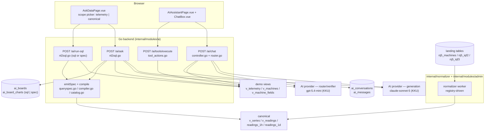
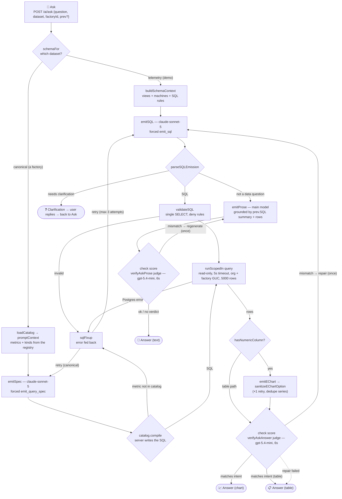
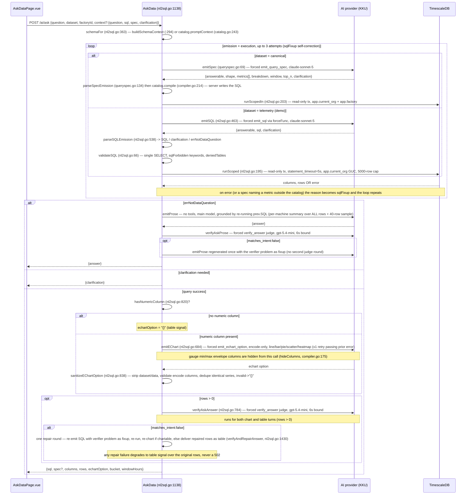
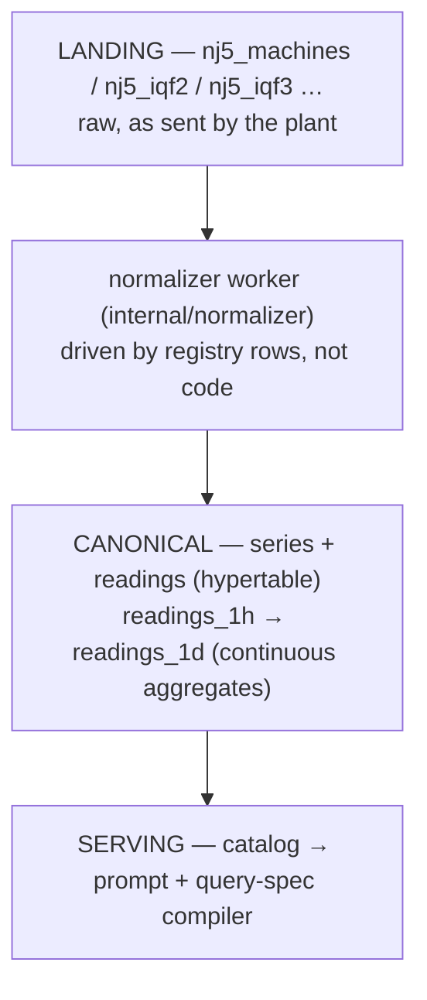
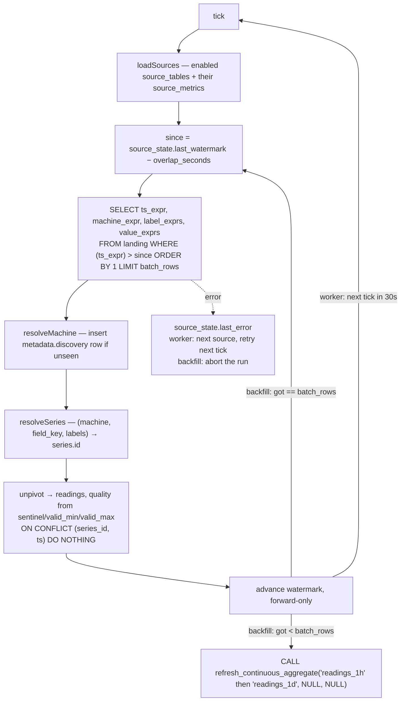
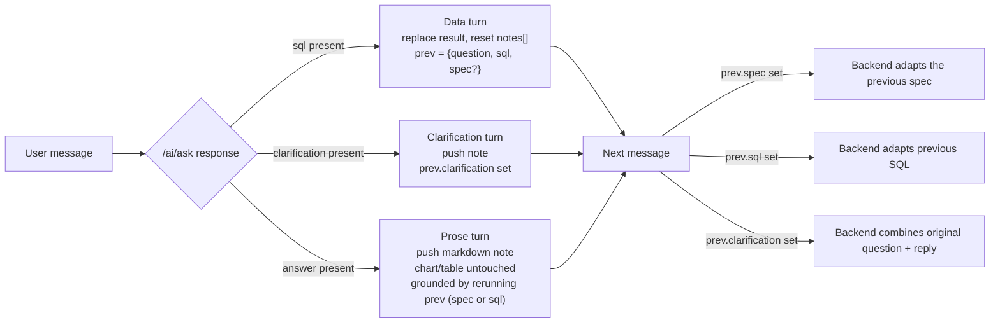
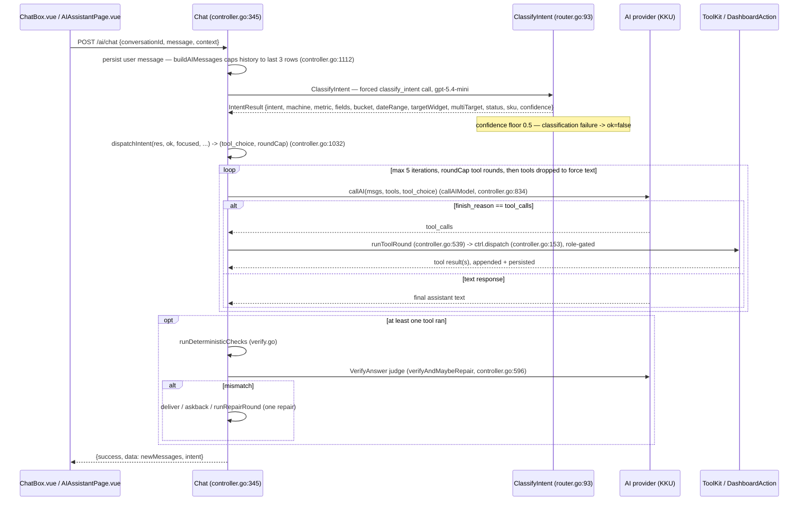

# IotVision — AI Pages: How Ask-Data & Chat Assistant Work

IotVision ships two independent AI surfaces, both backed by an OpenAI-compatible chat completions API. **Production runs on KKU GenAI** (`AI_BASE_URL=https://gen.ai.kku.ac.th/api/v1`): generation uses `claude-sonnet-5` (`AI_MODEL`); intent routing and answer verification use `gpt-5.4-mini` (`AI_ROUTER_MODEL` — deliberately a different model family so router/judge quota is isolated from the generation pool). Provider, models, and key are set via `AI_BASE_URL`, `AI_MODEL`, `AI_ROUTER_MODEL`, and `AI_API_KEY`; unset values fall back to Groq (`api.groq.com`, `openai/gpt-oss-120b` / `openai/gpt-oss-20b`, legacy `GROQ_API_KEY`). `aiBaseURL()` accepts either a provider base (`…/v1`) or a full completions URL — it auto-appends `/chat/completions` when missing. The **Ask-Data** page turns a natural-language question into a hardened, read-only query and an LLM-authored ECharts option — on the demo dataset the model writes the SQL, and on a real plant it emits a query *spec* that the server compiles (so the aggregation comes from a metric catalog, not from the model). The **Chat Assistant** is a conversational agent that reads live telemetry and stages dashboard edits through structured tool calls, gated behind a preview-then-confirm workflow. This document explains both pipelines end to end for developers extending or debugging them.

## Table of contents

1. [Overview — two surfaces](#1-overview--two-surfaces)
2. [Ask-Data pipeline](#2-ask-data-pipeline-the-ask-page)
   - [2.1 Frontend flow](#21-frontend-flow)
   - [2.2 Backend pipeline](#22-backend-pipeline)
   - [2.3 Canonical dataset internals](#23-canonical-dataset-internals)
   - [2.4 Turn types & follow-up thread](#24-turn-types--follow-up-thread)
   - [2.5 Security hardening](#25-security-hardening)
   - [2.6 Boards](#26-boards)
   - [2.7 Example Q&A](#27-example-qa)
   - [2.8 Layer map & call budget](#28-layer-map--call-budget)
3. [Output checking](#3-output-checking)
4. [Chat Assistant pipeline](#4-chat-assistant-pipeline)
   - [4.1 Frontend](#41-frontend)
   - [4.2 Backend](#42-backend)
   - [4.3 Tools](#43-tools)
   - [4.4 Widget element-click](#44-widget-element-click)
5. [API reference](#5-api-reference)
6. [Current limits & scope](#6-current-limits--scope)

---

## 1. Overview — two surfaces

**In short:** IotVision's AI capability is split into two surfaces that share the same AI provider account and org-scoped database access but do not share code paths, conversation state, or UI.

| Surface | Page | Backend | Purpose |
|---|---|---|---|
| Ask-Data ("Ask" page) | `frontend/src/pages/AskDataPage.vue` | `backend/internal/modules/ai/nl2sql.go`, `catalog.go`, `queryspec.go`, `compiler.go`, `boards.go` | Natural language → rows → LLM-authored ECharts option; boards to save charts; follow-up thread. |
| AI Assistant (chat) | `frontend/src/pages/AIAssistantPage.vue` + `ChatBox.vue`, `PreviewCanvasCard.vue`, `CreatedCanvasCard.vue`, `TextCanvasCard.vue` | `controller.go`, `router.go`, `schema.go`, `tool_actions.go`, `dashboard_action.go`, `verify.go` | Conversational assistant reading live metrics and staging dashboard edits via structured tool calls. |

**Ask-Data answers against one of two datasets**, chosen by a scope picker on the page. They share the entire second half of the pipeline (chart authoring, judge, zoom, boards) and differ only in how a question becomes SQL:

| Dataset | Data | How SQL is produced | Prompt |
|---|---|---|---|
| `telemetry` (default, `/ask/demo`) | the demo org's mock telemetry (`telemetry_raw` via `v_telemetry`) | **the model writes SQL**, validated by `validateSQL` | `buildSchemaContext` — views + machine names + SQL rules |
| `canonical` (`/ask/nj5`, or any factory) | real plant data in `series` + `readings`, fed by the source registry | **the model emits a query spec; the server writes the SQL** (`compiler.go`) | `catalog.promptContext()` — generated from registry rows |

The canonical path exists because prose cannot enforce semantics: the demo prompt *asks* the model to use `MAX-MIN` on a cumulative counter and `AVG` on a gauge, and nothing checks that it complied. On the canonical path the spec names a metric, the catalog says what kind of thing that metric is, and the server picks the aggregation — a wrong formula is not expressible. See §2.3.



---

## 2. Ask-Data pipeline (the "Ask" page)

**In short:** the Ask page takes a question, turns it into a read-only query (the model writes SQL on the demo dataset, the server compiles SQL from a model-authored spec on a real factory), executes it against allowlisted views, and (for numeric results) has the model author a chart option that the frontend renders — with self-correction and verification loops at every risky step.

### 2.1 Frontend flow

`AskDataPage.vue` is a self-contained page: a global `<v-chart>` from `vue-echarts` is used for rendering, laid out as a left "Boards" rail alongside a main "Ask …" column.

**State:**

| Field | Meaning |
|---|---|
| `question` | The current input text. |
| `asking` | In-flight guard while a request is pending. |
| `result` (`AskDataResult`) | The current chart/table payload — now also carries `spec` on the canonical path. |
| `notes[]` | The follow-up Q&A thread rendered under the current result. |
| `askedQuestion` | The question that produced the current `result`. |
| `prev` | Previous-turn context passed back to the backend for follow-ups (`{question, sql, spec?, clarification?, windowHours?}`). |
| `scope` / `scopes[]` | Which dataset the page asks against, and the list offered by `GET /ai/scopes`. |

**Scope and the URL.** `scope` is `{dataset, factoryId, slug, label}`, and it lives in the URL: one route `/ask/:scope` covers every dataset. `demo` is the mock telemetry; anything else is a plant, matched against `factories.slug` (`/ask/nj5`) or its uuid for a factory with no slug. Bare `/ask` redirects to `/ask/demo`. The param is only a name — `loadScopes()` resolves it to the real `factoryId` and label from `GET /ai/scopes`, so a canonical scope is briefly unresolved on mount and the `ready` computed disables Ask until it isn't. An unknown slug, or a factory with no registered sources, falls back to the first available scope **through `switchScope`**, so the address bar is corrected too. `switchScope(next)` clears everything on screen (different machines, different metrics, and a spec compiled for another factory) **and navigates**: `router.replace` to `/ask/<slug|uuid|demo>`. The sidebar and top bar read the route, not page state, so leaving `/ask/nj5` in the address bar while showing demo data would highlight the wrong nav item and bookmark a lie. Nothing about a specific plant is hardcoded in the frontend: the slug is seeded by `scripts/nj5-registry.sql`, so plant #2 gets its own URL by registering, not by a frontend change.

**`ask()`** (`AskDataPage.vue:~262`) trims the input, calls `api.askData(q, prev, scope.dataset, scope.factoryId)`, and branches on the response shape:

- `res.sql` present → a **data turn**: replace `result`, reset `notes`, set `prev = {question, sql, spec, windowHours}`.
- `res.clarification` present → push a clarification note and set `prev.clarification`; the user's next message is treated as the answer to that question.
- otherwise `res.answer` → push a prose note.

Prose and clarification turns annotate the current chart rather than clearing it.

**`replayOf(chart)`** picks how to re-run something: a canonical chart is defined by its `spec` (recompiled server-side, so a zoom also drops to a finer rollup), a legacy chart by its stored SQL text.

**`withDataset(option, columns, rows)`** (`AskDataPage.vue:~118`) merges the data-less ECharts option returned by the backend with `{dataset: {source: [cols, ...rows]}}`, and owns chart layout (the model writes the title text and legend labels; the page decides where they sit — title on row 0, legend on row 1, plot below both, since left to itself the model puts both on the same row and a long Thai title runs under the legend). It then applies, in order:

- **Gap padding** (`padTimeGaps`) — a bucket with no readings is a *missing row*, not a zero, so ECharts would draw one straight segment across it and it reads as steady running. One `null` point is inserted per hole, with the step taken from the median delta of the data itself (works on every path, no dependence on the reported bucket).
- **Min–max band** — when the backend shipped `<field>_min`/`<field>_max` beside a gauge mean (see §2.3), two stacked helper series shade min…max behind the line: an invisible one up to `min`, then a computed `__span_<field>` (`max - min`) carrying `areaStyle`. `stackStrategy:'all'` is load-bearing — ECharts stacks same-sign values by default, so with a min of −36 the span would stack from zero and float the band above the axis. `legend.data` lists only the model's own series so the helpers stay out of the legend.
- **Per-machine split** — if the option has exactly one `line`/`bar`/`scatter` series with string `encode.x`/`encode.y` and a category column is present (e.g. `machine`), it rewrites the option into N filter-transform datasets and N series — one line per machine, with a 2–20 category ceiling — and moves the legend to a vertical list on the right.

**`isTabular(option)`** — an empty `{}` option is the backend's signal to render the result as a table instead of a chart.

Prose answers are rendered as markdown via `marked` + `DOMPurify`.

**API client:** `frontend/src/services/api.service.ts` — `askScopes()`, `askData(question, context?, dataset?, factoryId?)` (`POST /ai/ask`, 60s timeout), `runSql({sql} | {spec, factoryId}, range?)`, plus `listBoards`, `createBoard`, `getBoard`, `addBoardChart`, `deleteBoardChart`.

### 2.2 Backend pipeline

**In short:** the backend forces the model to emit a query through a tool call — SQL on the demo dataset, a query spec on a real factory — validates or compiles it, runs it read-only with retries, then (if the result is numeric) has a second forced tool call author a chart option that gets sanitized and verified before it ever reaches the browser.

The full loop at a glance — retries and repair drawn as return arrows:



Entry point `AskData` (`nl2sql.go:1138`), routed at `POST /ai/ask` in `routes.go`.



Numbered walkthrough (same substance as the sequence diagram, for reference):

1. **`schemaFor(ctx, scope, orgID)`** (`nl2sql.go:363`) picks the prompt from the scope. For `telemetry` it calls **`buildSchemaContext(ctx, orgID)`** (`nl2sql.go:294`) — describing the demo views (`v_telemetry`, `v_machines`, `v_machine_fields`) plus the org's real machine names and metric keys, and the SQL rules the model must follow: use `time_bucket`, use `now()`-relative windows, use `ILIKE '%code%'` for machine-code matching, and access metrics via JSONB `data->>'key'`. For `canonical` it calls `loadCatalog` + `promptContext()` (§2.3). The retired `"nj5"` dataset returns an explicit error rather than falling through to the demo prompt, which would answer confidently about the wrong data.
2. **`emitSQL(ctx, question, schema, prev, fixup)`** (`nl2sql.go:463`) — demo path only: one forced tool call to `emit_sql` via `forceFunc("emit_sql")` on the generation model (`claude-sonnet-5`); the tool schema is `{answerable, sql, clarification}`. Follow-ups are handled by prompt injection: if `prev.SQL` is set, the prompt asks the model to adapt the previous SQL; if `prev.Clarification` is set, it combines the original question with the user's reply. Two prompt rules keep the model from over-clarifying (added 2026-07-17 for claude-sonnet-5): an explain/definition question ("what does X mean", "อธิบาย", "ต่างกันยังไง") must set `answerable=false` (prose path) and never a clarification; and when a reasonable default exists (no time range → last 24h, fuzzy "drops/low" → below the window average) the model answers with the default instead of asking back — clarification is reserved for questions where no metric/machine/dimension is identifiable at all. `parseSQLEmission` (`nl2sql.go:538`) returns SQL XOR a clarification, or the sentinel error `errNotDataQuestion`.
2b. **`emitSpec(ctx, question, schema, prev, fixup)`** (`queryspec.go:69`) — canonical path: the same forced-tool-call shape, but the tool is `emit_query_spec` and the model returns *intent*, never SQL: `{answerable, shape, metrics[{field, machine, machine_type, labels, agg}], breakdown[], window{hours|from,to}, top_n, clarification}`. The prompt states plainly that the model does not choose how a metric is aggregated. `parseSpecEmission` (`queryspec.go:134`) applies the same clarification/prose/`errNotDataQuestion` contract as `parseSQLEmission`, then `catalog.compile` (`compiler.go:214`) turns the spec into SQL; a spec naming a metric outside the catalog is rejected and its reason is fed back as the fixup, so the retry loop is shared.
3. **Branch on the emission:** `errNotDataQuestion` routes to the prose path `emitProse` (`nl2sql.go:578`, main model) — a no-tools completion grounded by re-running the previous turn via `rerunPrev` (`nl2sql.go:1391`): a canonical turn recompiles `prev.Spec`, a demo turn re-validates and re-runs `prev.SQL`. It is then fed a per-machine summary (min/max/avg computed over ALL rows, so no extreme is thinned away) plus a 40-row sample for trend shape. The answer then passes a prose judge, `verifyAskProse` — same contract as the chart judge (6s bound, `gpt-5.4-mini`, forced `verify_answer`): a MISMATCH verdict (off-topic answer, or a number contradicting the grounding rows) triggers exactly one regenerate with the verifier's problem as fixup, no second judge round; no verdict or a failed regenerate delivers the original answer — never a 502. Returns `{answer}`. A clarification response returns `{clarification}` directly. Otherwise the SQL path continues.
4. **`validateSQL`** (`nl2sql.go:66`) — enforces a single `SELECT` statement, rejects forbidden write keywords (`sqlForbidden`), and rejects any access to base tables (`deniedTables`), scrubbing the allowed `v_` views first. It guards **model-written** SQL only; compiled SQL is server-authored and deliberately skips it (§2.5).
5. **`runScoped(ctx, orgID, sql)`** (`nl2sql.go:195`) — opens a read-only transaction, sets `SET LOCAL statement_timeout='5s'`, sets `set_config('app.current_org', orgID, true)` as a Postgres GUC for org isolation, and caps results at 5000 rows. `runScopedIn` (`nl2sql.go:203`) is the same thing plus `app.factory`, used by every canonical query. A retry loop runs up to 3 times: any validation failure, compile failure or Postgres error is turned into a `sqlFixup` message fed back into `emitSQL`/`emitSpec` so the model can self-correct.
6. **`hasNumericColumn(cols, rows)`** (`nl2sql.go:820`) — if there is no numeric column, or the result is empty, the response sets `option = "{}"` (the table signal) and skips the chart-authoring model call entirely.
7. **`emitEChart(question, cols, sample20, prevErr, bucket, summary)`** (`nl2sql.go:684`) — a forced `emit_echart_option` call. The system prompt (`echartSystemPrompt`) requires `encode`-based column references (no embedded data arrays) and a chart type of line, bar, pie, scatter or heatmap; one series per quantity, with an explicit exception for **two different numeric columns** (e.g. `produced_count` and `evap_temp`), which get one series each on separate axes (`yAxis:[{},{}]`, second series `yAxisIndex:1`, counted quantity as bar and measured one as line). Gauge envelope columns are hidden from this call by `hideColumns` (`compiler.go:175`) so the model keeps encoding the mean. One retry is attempted, passing the prior error back to the model.
8. **`sanitizeEChartOption(option, cols)`** (`nl2sql.go:838`) — strips any `dataset`/`data` the model tried to embed, validates that `encode` references real columns, and dedupes series: series that share the same type and `encode` without per-series filters would render identical rows, so only the first is kept — the frontend's `withDataset` performs the actual per-machine split. An invalid option collapses to `"{}"`.
9. **`verifyAndRepairAnswer`** (`nl2sql.go:1430`) runs on chart AND table turns whenever at least one row was returned (empty results are skipped — nothing to judge beyond the SQL text) — `verifyAskAnswer` (`nl2sql.go:784`) runs a bounded 6-second forced `verify_answer` judge call on the router model (`gpt-5.4-mini`). A chart type the user explicitly requested (pie/bar/line/scatter, any language) is correct by definition — the judge only evaluates the data (metric, machine, time window), never a user-chosen style. On `matches_intent:false`, exactly one repair round runs: SQL is re-emitted with the verifier's `problem` text as the fixup and re-run. If the repaired result is chartable it is re-charted; otherwise the repaired rows are delivered as a table. Only a failed emission/validation/run, or an empty repaired result, falls back to the original rows (chart degraded to the table signal) — the endpoint never returns a 502 for a verification miss.
10. **Response shape:** one of `{sql, spec?, columns, rows, echartOption, bucket, windowHours}`, `{answer}`, or `{clarification}`. `spec` is present only on the canonical path and is what the frontend stores for replay and zoom.

### 2.3 Canonical dataset internals

**In short:** for a real plant, the semantics that used to live in a prompt live in database rows instead, and the server compiles the SQL — so registering a new machine or metric is an `INSERT`, and applying the wrong aggregation to a metric is not expressible.

**Three layers.** Landing tables are whatever upstream sent (never modified, never dropped, always in `deniedTables`); a worker normalizes them into the canonical model; the serving layer is one page with a factory picker.



**Registry** (created in `migrate.go`, seeded for NJ5 by `scripts/nj5-registry.sql`):

| Table | Holds |
|---|---|
| `source_tables` | one row per upstream table: `shape`, `ts_expr`, `machine_expr`, `label_exprs` (jsonb), `overlap_seconds`, `batch_rows`, `reader`, `enabled` |
| `source_metrics` | one row per column worth ingesting: `column_name`, `value_expr`, `field_key`, **`kind`**, `unit`, `sentinel`, `valid_min`, `valid_max`, `llm_note` |
| `source_state` | per-source ingest state: `last_watermark`, `last_run_at`, `rows_ingested`, `last_error` |

Every fact that used to be a sentence in the prompt is now a column: "count_fg is cumulative" → `kind='counter'`; "9999 means no reading" → `sentinel=9999`; "rail_temp is always NULL" → simply not registered, so the catalog cannot mention it and the model cannot ask for it.

**Normalizer** (`internal/normalizer/`, same `New/Start/Stop` + ticker shape as `internal/broadcaster`, wired in `cmd/server/main.go`, 30s tick). Per enabled source: read the watermark and step back `overlap_seconds`; build the `SELECT` from registry expressions (identifiers quoted with `pgx.Identifier{}.Sanitize()`, no user input reaches it); resolve the machine, inserting an `auto_discovery` row if it is new (a machine the plant adds overnight is answerable the next morning); resolve `(machine, field_key, labels)` to a `series`; unpivot into `readings` with `quality` set from `sentinel`/`valid_min`/`valid_max` (**the value is kept**, filtering happens at serving time); insert with `ON CONFLICT (series_id, ts) DO NOTHING` so the overlap re-read and any replay are free; advance the watermark in the same transaction, forward-only. An error is written to `source_state.last_error` without killing the worker. `cmd/normalize-backfill` drains a historical dump in one pass and then refreshes the continuous aggregates over all time (the refresh *policy* only covers a recent window, so a year-old dump would otherwise never be materialized).



**Worker vs. backfill** — same engine (`syncSource`), different driver:

| | worker (`internal/normalizer`, `main.go:93`) | CLI (`cmd/normalize-backfill`) |
|---|---|---|
| lifetime | 30s ticker, runs with the server | one pass, then exits |
| batches per source | one per tick | loops until a short batch — drains everything |
| context timeout | 5 min per tick | 6 h for the whole run |
| a source errors | recorded, other sources continue, retried next tick | aborts the run |
| continuous aggregates | untouched — relies on the refresh *policy* (7d for `readings_1h`, 30d for `readings_1d`) | refreshed over all time, hourly before daily |

Both take the same watermark/overlap path and write idempotently, so the CLI is safe to run against a live server. Reach for it after registering a source (the worker starts from the current watermark and never looks back) or after loading a historical dump (rows land in `readings`, but a wide-window question reads rollups that the policy will never materialize that far back). Steady-state ingest needs neither.

**Rollup ladder.** `readings_1h` aggregates raw readings where `quality = 0`; `readings_1d` is a hierarchical continuous aggregate over `readings_1h`. Both store `sum_v, n, min_v, max_v, first_v, last_v` — **not** `avg`, because an average of hourly averages is wrong whenever buckets hold different numbers of readings; `sum_v/n` gives the exact weighted mean at any level. There is deliberately no 1-minute rollup (readings already arrive about once a minute, so it would have as many rows as the raw table); narrow windows read raw.

**Catalog → prompt** (`catalog.go`). `loadCatalog(ctx, factoryID)` (`catalog.go:83`) reads the registry joined with the series that actually exist; `promptContext()` (`catalog.go:243`) renders it. The cache is keyed by a version stamp (`max(updated_at)` + row counts, `catalogVersion` `catalog.go:189`), so a steady system produces byte-identical prompts (provider cache stays warm) and registering a metric invalidates it by itself. Prompt size grows with the number of *metric kinds*, not machines: metrics are described once per `machine_type`, the machine list caps at 24 and label values at 30 (beyond that the model is told to ask the catalog with `shape=list`), and one question is scoped to one factory — so ten plants cost the same prompt as one.

**Compiler** (`compiler.go`). `aggSQL(kind, tier, agg, filter)` (`compiler.go:110`) is the single place a metric kind becomes SQL:

| kind | rollup tier | raw tier |
|---|---|---|
| `counter` | `SUM(GREATEST(last_v - first_v, 0))` | `GREATEST(MAX(value) - MIN(value), 0)` |
| `gauge` | `SUM(sum_v) / NULLIF(SUM(n),0)` — weighted mean (`min`/`max` on request) | `AVG(value)` |
| `event` | `SUM(sum_v)` | `SUM(value)` |
| `state` | `last(last_v, bucket)` | `last(value, ts)` |

`last_v - first_v` (not `MAX - MIN`) is what makes a cumulative counter exact: the piece of a delta that straddles a bucket edge is not lost, and a counter reset is visible as `last_v < first_v` and clamped to zero instead of being counted as production. `tierFor(bucket)` (`compiler.go:67`) is the only resolution rule — finer than an hour reads `v_readings` (adding `quality = 0`), 1–6 hours reads `readings_1h`, a day or coarser reads `readings_1d` — and the bucket itself comes from the existing `autoBucket(window)` (`nl2sql.go:139`), so a wide window automatically gets a coarse tier.

Two deliberate details in the generated SQL:

- **Every value the model supplied is a bind parameter** (`argBuilder`), and an unknown label key is dropped rather than passed through — there is a test that feeds `'; DROP TABLE readings; --` as a label name and asserts it never reaches the SQL. The only interpolated parts are chosen from fixed server-side sets: relation, aggregate, group-by ordinals, and the time bounds.
- **The time bounds are literals, not `$1/$2`** (`tsLiteral`, `compiler.go:95`). Measured on 28M NJ5 readings: the same counter query took **545 ms with literal bounds and 65 s with bind parameters**, because TimescaleDB excludes chunks (and the raw half of a real-time aggregate) while *planning*, which a bind parameter defeats. It is safe because `from`/`to` are `time.Time` values the server computed, never model or user text.

**Gauge min/max envelope.** For `shape=timeseries` on a rollup tier, a gauge mean also selects `MIN(min_v)`/`MAX(max_v)` as `<field>_min`/`<field>_max` (`compiled.Band`). The reason is concrete: an hour where IQF2 ran at −35 °C and defrosted to +25 °C averages to **+1.6 °C**, a value the machine was never at, and a single line at +1.6 hides both states. The frontend shades min…max behind the line (§2.1). Not done for a counter (a delta has no envelope), for an explicit `agg=min|max` (that *is* the extreme), or on the raw tier (every point is already a real value).

**Shapes.** `timeseries` (two metrics ⇒ dual axis), `bar` (ranked, honours `top_n`), `table`, and `list` — the last reads `v_series` to answer "what machines/SKUs/metrics exist?" with no time window at all (`compileList`, `compiler.go:345`).

The raw-SQL path stays as the escape hatch for the demo dataset and for questions the spec cannot express.

### 2.4 Turn types & follow-up thread

**In short:** every response is exactly one of three turn types, and the shape of `prev` sent back on the next request determines how that next message is interpreted.



### 2.5 Security hardening

> **Security hardening**
>
> | Rule | Enforcement |
> |---|---|
> | View allowlist | `allowedViews` (`nl2sql.go:44`) is five views — `v_telemetry`, `v_machines`, `v_machine_fields` (demo) and `v_series`, `v_readings` (canonical). No base table is ever exposed to generated SQL, and the list does **not** grow when a plant, machine or upstream table is added. |
> | Rollups excluded on purpose | `readings_1h`/`readings_1d` are **not** in the allowlist: a continuous aggregate is materialized separately, so a row policy on `readings` does not filter it. Compiled queries reach them safely because they always join `v_series`. Regression test: `TestRollupsAreNotReachableByGeneratedSQL`. |
> | SQL deny rules | `deniedTables` (`nl2sql.go:62`) covers every base table plus the landing tables (`nj5_*`, `src_*`), the registry, `series`/`readings`/`readings_1[hd]`, and the retired `v_nj5*` (the pattern also matches their `_legacy` names). `validateSQL` requires a single `SELECT` and rejects forbidden write keywords. |
> | Compiled SQL skips the validator — by design | The compiler's SQL is server-authored: it joins relations the validator denies, and no model text is interpolated into it (every model-supplied value is a bind parameter, unknown label keys are dropped). It is the *author*, not the *validator*, that makes it safe. |
> | Read-only execution | All generated SQL executes inside a read-only transaction. |
> | Org isolation | Enforced at the database layer via the `app.current_org` Postgres GUC, not just in application code. |
> | Factory isolation (canonical) | `runScopedIn` also sets `app.factory`; `series` has `ENABLE` + **`FORCE` ROW LEVEL SECURITY` with a policy on that GUC, and an unset GUC yields **zero rows, not all rows** (fail closed). `v_series`/`v_readings` are created `WITH (security_invoker = true)` — without it a view reads its base table with the *view owner's* rights and would hand another plant's series to a caller `series` itself would have blocked (measured: 150 rows vs 0). |
> | RLS is on `series` only | TimescaleDB refuses both a continuous aggregate and columnstore on an RLS table (`cannot create continuous aggregate on hypertable with row security`), so `readings` can have the rollup ladder or a row policy, not both. Rollups won; a reading is meaningless without its series, so every path joins `series` and inherits the filter. |
> | ⚠️ A superuser bypasses every policy | including `FORCE`. The docker-compose `POSTGRES_USER` (`iot_user`) is a superuser, so **on a default dev stack the factory RLS enforces nothing** and the compiled SQL is the only boundary. `migrate.go` prints a startup warning with the fix: `ALTER ROLE iot_user NOSUPERUSER NOBYPASSRLS;` (verified: with a plain role, unset GUC → 0 rows, wrong factory → 0 rows, right factory → all of it). |
> | Timeout | A 5-second `statement_timeout` bounds worst-case query cost. |
> | Row cap | Result sets are capped at 5000 rows (`maxRows`, `nl2sql.go:193`), plus the `LIMIT` the compiler writes itself. |
> | Stored SQL re-validated | Boards' `AddBoardChart` re-validates stored **SQL** through the same `validateSQL`/`runScoped` path even though it came from our own database. A chart stored as a **spec** is recompiled instead (the spec is JSON-validated and every value in it is bound). |

### 2.6 Boards

Implemented in `boards.go` against the `ai_boards` / `ai_board_charts` tables. A saved chart stores `{question, sql, spec?, factory_id?, echart_option, window_hours}`.

- **Demo chart** → stores SQL text; reopening re-runs it via `POST /ai/run-sql`, which re-validates it through the same hardening path.
- **Canonical chart** → stores the **spec**; reopening *recompiles* it. That is the point: SQL text freezes the relations it was written against and rots when they change, while a spec is intent and survives — it also picks a finer rollup tier automatically when the user zooms in, with no model call.

Both always show live data rather than a frozen snapshot. `scripts/nj5-board-audit.sql` reports charts still holding SQL that references retired relations; converting them back into intent is guesswork, so it lists the questions to re-ask instead of guessing.

### 2.7 Example Q&A

Illustrative only — actual SQL and chart shape depend on the org's live schema and data.

**Demo dataset (`/ask/demo`)**

- *"average weight per hour today for CW-01"* → SQL → line chart.
- *"compare output of all packing machines this week"* → backend returns a single-series option; the frontend's `withDataset` splits it into one line per machine.
- *"how are things?"* → clarification turn asking which machine, metric, and timeframe.
- Follow-up *"why did it dip at 14:00?"* after a chart → prose turn grounded in the previous SQL's rows.
- *"list machine names"* → no numeric column → table render.

**Canonical dataset (`/ask/nj5`)** — the spec the model emits is shown, not SQL:

- *"IQF2 ผลิตได้เท่าไหร่ 7 วันย้อนหลัง"* → `{shape:"timeseries", metrics:[{field:"produced_count", machine:"IQF2", labels:{area:"OutFeed*"}}], window:{hours:168}}` → counter delta per bucket.
- *"i want to see iqf2 temp compare pcs from 2026-07-14 07:00 to 2026-07-19 07:00"* → two metrics in one spec → dual-axis chart, bars for the count and a line for the temperature, with the min–max band behind the line.
- *"SKU ไหนผลิตมากที่สุดเดือนพฤษภาคม 2026"* → `{shape:"bar", metrics:[{field:"produced_count"}], breakdown:["sku"], window:{from:"2026-05-01", to:"2026-06-01"}, top_n:5}`.
- *"มีเครื่องจักรอะไรบ้าง"* → `{shape:"list", breakdown:["machine"]}` → reads `v_series`, no window, table render.
- *"freezing time IQF2 30 วันย้อนหลัง"* → compiles fine and returns **no rows**, because every value in that window was the 9999 sentinel (`quality=1`) and the rollups exclude it. The chart is empty and the system does not yet say why (§6).

### 2.8 Layer map & call budget

Conceptual layer ↔ code map for the Ask-Data pipeline (every structural check is deterministic Go; the model is called only where semantic judgment is required):

| Layer | Function / file | Model / mechanism |
|---|---|---|
| 1.1 Intent (`answerable`) | `emitSQL` → `parseSQLEmission` · `emitSpec` → `parseSpecEmission` | claude-sonnet-5, `forceFunc("emit_sql")` / `forceFunc("emit_query_spec")` |
| 1.2 Slot grounding | `schemaFor` → `buildSchemaContext` (demo) or `loadCatalog`/`promptContext` (canonical) | Go (deterministic) — live query via `runScoped`, registry rows for the catalog |
| 1.3 Clarification | `clarification` field in the same emission | claude-sonnet-5 |
| 2.1 SQL generation | `emitSQL` (demo — the model writes it) · `catalog.compile` (canonical — **Go** writes it from the spec) | claude-sonnet-5 / Go (deterministic) |
| 2.2 SQL validation + runtime guard | `validateSQL` (model-written only), `runScoped`/`runScopedIn`, `series` RLS | Go (deterministic) + Postgres |
| 2.3 Aggregation choice | `aggSQL` from `source_metrics.kind` (canonical) — prompt rules only on the demo path | Go (deterministic); not expressible by the model |
| 3.1 Chart-type pick | `echartSystemPrompt` + `hasNumericColumn` gate | model picks type / Go decides whether to call at all |
| 3.2 Chart spec generation | `emitEChart` (nl2sql.go) | claude-sonnet-5, `forceFunc("emit_echart_option")` |
| 4.1 Spec sanitize | `sanitizeEChartOption` (nl2sql.go) | Go (deterministic) |
| 4.2 Self-consistency judge | `verifyAskAnswer` → `verifyAndRepairAnswer` (nl2sql.go) | gpt-5.4-mini, `forceFunc("verify_answer")` |
| 4.3 Error handling | retry loop in `AskData` (SQL ×3, chart ×1) | Go (deterministic) — no LLM classifier |
| 5 Orchestration | `AskData` handler (nl2sql.go) | Go |

Model-call budget per turn (all inside the handler's 200s context; per-call cap 90s):

| Turn type | Calls |
|---|---|
| prose (not a data question) | `emitSQL`/`emitSpec` 1 + `emitProse` 1 + judge 1 (+ `emitProse` 1 on mismatch) = **3–4**. Emission, `emitProse` and its repair run on the **main model** (analysis quality matters); only the judge runs on the router model. |
| table (no numeric column) | emission **1–3** (retry loop); no chart/judge — `hasNumericColumn` gates before `emitEChart` |
| chart | emission 1(–3) + chart 1(–2) + judge 1 (~1s) |
| chart + judge-ordered repair (worst case) | above + emission 1 + chart 1(–2) |
| **zoom / board reopen** | **0** — a stored spec is recompiled server-side (`RunSQL`, `nl2sql.go:1470`); a stored SQL string is re-validated and re-run |

---

## 3. Output checking

**In short:** both surfaces bound their self-correction and verification work to a fixed, small number of retries so latency and provider token cost stay predictable — neither pipeline will loop indefinitely trying to get a "perfect" answer, and both degrade gracefully instead of failing outright.

| Stage | Ask-Data | Chat Assistant |
|---|---|---|
| Retry-on-error loop | Self-correction loop, up to 3 attempts total (`validateSQL`/compile/Postgres error → `sqlFixup` → re-emit via `emitSQL` or `emitSpec`) | Tool loop, max 5 iterations bounded by `roundCap` |
| Secondary generation retry | Chart authoring (`emitEChart`) retries once, passing the prior error back to the model | — |
| Deterministic checks | — | `runDeterministicChecks` (`verify.go`) — for `preview_add_widget` and `preview_update_widget`, the new metric/fields must exist on the target machine (`checkFieldsExist` against `machine_fields`); for `preview_dashboard`, every planned widget must carry a metric. Any check it can't resolve (no machine on hand, empty lookup) is skipped, never failed. Plus `checkMultiTargetCoverage` — when the router flagged `multiTarget`, fewer than two `preview_update_widget` calls means the turn edited only part of what was asked (first pass only; the post-repair re-check deliberately skips it so a text-only repair isn't trapped in ask-back). |
| LLM judge | `verify_answer` via `verifyAskAnswer` (chart + table turns; empty results skipped; user-specified chart types never judged) and `verifyAskProse` (prose turns — topicality + rows-contradiction), both `gpt-5.4-mini`, 6s bound | `VerifyAnswer` judge |
| Repair | Exactly one repair round (chart/table: re-emit SQL with verifier's `problem` as fixup, re-run, re-chart; prose: regenerate the answer once) | One `runRepairRound` |
| Failure outcome | Degrades to table signal (`{}` echart option) — never a 502; a provider daily-quota error is the exception → 429 `QUOTA_EXCEEDED` | Outcome is deliver / ask back / repair; provider daily-quota error → 429 `QUOTA_EXCEEDED` (else 502 `AI_ERROR`) |

Design rationale: bounded checks keep worst-case latency and provider token cost predictable regardless of how ambiguous or malformed a given question or tool round turns out to be. The same principle decides *what* gets an LLM call at all: every structural check (schema validity, SQL safety, encode-column validation) is deterministic Go code; the LLM is reserved for genuine semantic judgment (intent, chart appropriateness, answer-vs-question consistency) — cutting cost, latency, and nondeterminism at every step that doesn't need a model.

The canonical path takes that one step further: instead of *checking* the model's SQL, it never asks for SQL. Whole classes of error stop being possible rather than being caught — summing a cumulative counter, averaging averages, reading another factory's rows, injecting through a label value. What remains checkable is checked offline: `compiler_test.go` holds **20 tests** that run with no database and no provider (`go test ./internal/modules/ai/ -count=1 -skip 'Live|BakeOff|DateEdit|ComplexFlows'`), covering counter-never-sums, weighted gauge means, tier selection, `top_n` ranking, unknown metric rejected, unknown label dropped (with a `'; DROP TABLE readings; --` payload), values bound not interpolated, the gauge envelope, and the rollups staying unreachable from generated SQL.

---

## 4. Chat Assistant pipeline

**In short:** the chat backend classifies user intent with a small cheap model, uses that classification in plain Go to decide which tool (if any) the generation model is forced to call, runs a bounded tool-calling loop, and verifies the final answer before returning it.

### 4.1 Frontend

`AIAssistantPage.vue` hosts the conversation; `ChatBox.vue` renders the message list and input.

`buildDashboardContext(focusedIds)` (`AIAssistantPage.vue:~464`) serializes the on-screen dashboard/widget state into context lines such as:

```
- [FOCUSED] line-chart "Trend" — machine CW-01, metric weight, bucket 1h
```

and injects a focused widget's on-screen data so a read is answerable with no tool call: `seriesLine` appends a line-chart/daily-count's full series, and `alarmLine` appends a focused alarm-panel's active-alert list (same severity/machine filter as `AlarmPanelWidget.displayAlerts`, `"none (All Clear)"` when empty). Both emit the literal `on-screen data` marker the backend keys `inlineData` off. `@Widget` mention tokens let the user route an edit request to a specific widget explicitly.

`api.chat(conversationId, text, context)` calls `POST /ai/chat`, which returns `{messages, intent}`. Three card components render the results:

- `PreviewCanvasCard` — a staged dashboard preview produced by the `preview_*` tools.
- `CreatedCanvasCard` — a confirmed/created dashboard.
- `TextCanvasCard` — plain text answers.

### 4.2 Backend

Entry point `Chat` (`controller.go:345`).



Numbered walkthrough:

1. Persist the user message; history is capped to the last 3 user/assistant rows (`buildAIMessages`, `controller.go:1112`).
2. The outgoing message list is `systemPromptUnified` (a large provider-cached prompt) + capped history + an authoritative context block containing dashboard state and today's date.
3. **Intent router** (`router.go`): `ClassifyIntent` (`router.go:93`) makes one forced `classify_intent` call on the router model (`gpt-5.4-mini` — bake-off 29/32 on the 32-case intent suite, 2026-07-17), returning strict JSON `IntentResult{intent, machine, metric, fields, bucket, dateRange, targetWidget, status, sku, confidence}`. Recognized intents: `chat`, `read_metric`, `read_agg`, `edit_widget`, `compare`, `create_dashboard`, `alerts`, `production`. `confidence` is **self-reported by the model** (0..1, per a 3-band rubric in `routerSystemPrompt` — 0.85+ unambiguous, 0.5–0.85 loose wording, below 0.5 genuinely ambiguous); it is not a logprob or a calibrated probability. A confidence floor of 0.5 applies (`parseIntentResult`, `router.go`); below it — or on any classification failure — `ok=false` and the caller falls back to auto tool selection. Design law: **the model classifies, Go decides.**
4. `dispatchIntent(res, ok, focused, inlineData, role, machineValid, chartExists)` (`controller.go:1032`) is a pure Go function that maps the classified intent to a `(tool_choice, roundCap)` pair — no LLM call is involved in this decision.

| Intent | Forced tool_choice |
|---|---|
| `read_metric` | `show_metric` |
| `read_agg` | `get_telemetry_series` |
| `production` | `get_production_count` |
| `alerts` | `get_active_alerts` |
| `edit_widget` | `preview_update_widget` |
| `compare` | `preview_update_widget` or `preview_add_widget`, chosen by `chartExists` |
| `create_dashboard` | `preview_dashboard` |
| focused read/chat with inline data | `tool_choice: "none"` — answered from injected context, no tool call. Fires for any read/chat intent (`readOnlyIntents`: `chat`/`read_metric`/`read_agg`/`production`/`alerts`) when a focused widget shipped its on-screen data. This also rescues a router miss: a focused `daily-count`/`alarm-panel` that the router mislabels `chat` still answers correctly from context, so the classification error is cosmetic. |
| classification failed | `""` (auto — model chooses) |

5. **Tool loop:** up to 5 iterations total, chained across `roundCap` rounds. `callAI(msgs, tools, tc)` is called each iteration; when `finish_reason == "tool_calls"`, `runToolRound` (`controller.go:539`) dispatches through `ctrl.dispatch` (`controller.go:153`) (role-gated), and the tool results are appended to the message list and persisted. Once `roundCap` tool rounds are used, tools are dropped from the next call to force a final text summary.
6. **Verify-then-repair:** `verifyAndMaybeRepair` (`controller.go:596`) runs only when at least one tool executed. Deterministic checks (`runDeterministicChecks` in `verify.go`) run first — they validate that any metric/fields introduced by `preview_add_widget`/`preview_update_widget` exist on the target machine, that a `preview_dashboard` plan has no metric-less widgets, and that a `multiTarget` turn actually edited more than one widget — followed by an LLM `VerifyAnswer` judge. A failed deterministic check skips the judge entirely and goes straight to repair, so the common failures cost no extra tokens. The outcome is deliver, ask back, or one repair round (`runRepairRound`).
7. **Response:** `{success, data: newMessages, intent}`.

### 4.3 Tools

`schema.go`'s `AllTools()` (`schema.go:258`) exposes: `get_machines`, `show_metric`, `get_telemetry_trend`, `get_active_alerts`, `get_telemetry_series`, `get_production_count`, `get_skus`, `list_dashboards`, `preview_dashboard`, `preview_add_widget`, `preview_remove_widget`, `preview_update_widget`.

`create_custom_dashboard` is deliberately **excluded** from `AllTools()` — only the frontend calls it, via `POST /ai/tools/execute`, and only after the user clicks Confirm on a staged preview. This enforces the preview-then-confirm workflow: the model can never create a dashboard directly, it can only stage one.

Tool implementations live in `tool_actions.go` (ToolKit methods) and `dashboard_action.go` (`DashboardAction`'s `Preview`/`PreviewAddWidget`/`PreviewUpdateWidget`/`Handle` methods).

`buildAIToolsWith(role, slimAll)` (`controller.go`; `buildAITools(role)` is the full-schema wrapper) filters the tool list by role — viewers lose write/preview tools. Simple tools always go over slim (name + description only). The three `preview_*` widget tools keep their full schemas **only on edit-intent turns and router fallback**; when the router classifies the turn as a read (`chat`/`read_metric`/`read_agg`/`production`/`alerts`, see `readOnlyIntents`) they are sent slim too (~850 tokens saved per call) while remaining callable in case of a misclassification. When `dispatchIntent` pins `tool_choice` to a single function (a `forceFunc` choice), the Chat loop sends **only that one tool's schema** on turn 0 (`forcedFuncName` + `oneAITool`, `controller.go`) instead of the whole ~2k slim set, and drops tools entirely for the summary call — the forced function resolves the turn in one round, so the other schemas are dead weight the model can't call. Per-call token logging (`[ai call] model=… prompt=… completion=… total=…`) at the `callAIModel` choke point confirmed this: a `production` turn's two sonnet calls are prompt-dominated (~4.8k prompt, ~90 completion each), i.e. the cost is the re-sent system prompt + tool schemas, not hidden reasoning. Each per-intent variant stays byte-stable, so provider-cacheable prefixes are preserved.

Token budget (2026-07-20): every call carries `max_completion_tokens` (`AI_MAX_TOKENS`, default 2048 — hidden reasoning counts against it, so don't set below ~1024). Tool results for `get_telemetry_series` / `get_production_count` are capped at 100 stride-sampled rows plus a `summary` (min/max/avg/total computed over the full data before sampling), since those results are re-sent on every remaining loop iteration.

**Capacity, derived from the measured suites:** /ask averages ~4,700 tokens per question (183,542 ÷ 39, 2026-07-22) and /ai ~11,400 tokens per turn (57,141 ÷ 5, 2026-07-21). Against KKU's 200k tokens/day — shared across the whole org, and shared with test runs — that is roughly **42 /ask questions or 17 /ai turns per day**. The 11% reduction above bought ~2 extra chat turns per day. One full /ask live suite run consumes nearly the entire daily budget, which is why it runs once a day at most.

`tool_choice` serialization in `callAIModel` (`controller.go:834`): an empty string means auto, `"required"`/`"none"` are sent as plain strings, and a value starting with `{` is sent as a forced-function object. Provider `tool_choice` errors are retried with auto; a function-parser failure is retried with no tools at all. The response parser (`aiError.UnmarshalJSON`, `controller.go`) tolerates both OpenAI-style `{"error":{"message":...}}` objects and bare-string errors (`{"error":"This model reached daily limit."}` — the KKU proxy's format).

**Provider error mapping** (`callAIModel`): a per-minute rate-limit blip (provider HTTP 429) is retried internally for short waits, else surfaced as `rateLimitError` → **429 `RATE_LIMIT`** with a `retryAfter` seconds hint. A per-day quota exhaustion — the KKU `"...daily limit"` message — is detected and returned as a typed `quotaError` → **429 `QUOTA_EXCEEDED`** with message "AI daily quota reached. Please try again later." Both surfaces map it: `/ai` Chat via an `errors.As` branch in its loop, `/ask` AskData via the shared `askAIError` helper (used at its `emitSQL`/`emitProse` sites). The distinct code lets the frontend tell "come back later" (quota) apart from "retry shortly" (rate limit) and from a generic **502 `AI_ERROR`** (real provider failure). This is the mapping only — the daily quota is pooled per model family (see `llm2viz/test-results.md` §3).

### 4.4 Widget element-click

**In short:** shipped 2026-07-18/19, **`/ai` only** — clicking an element inside a widget (an axis, a data point, the value, etc.) attaches it as a one-line context hint to the *next* chat message via a mention chip. This is separate from the `@Widget` mention token described in §4.1 (which mentions a whole widget by typing `@`): element-click mentions a specific *part* of a widget, and there is no auto-ask — the user still types and sends the question.

- A click adds a mention chip next to the input, e.g. `Weight Trend · y-axis`, or for a data point `Weight Trend · 14:00 · 42`.
- The same click injects a one-line hint into the `dashboardContext` sent with the chat request, e.g. `user clicked the y-axis (kg)` or `user clicked point: x=14:00, value=42 (series Weight)`.
- **One element per widget** — clicking a new element on the same widget overwrites the previous selection; only the latest click per widget is kept.
- Chips clear on: send, clicking a chip's ✕, deselecting the widget, or New chat.

**Elements per widget:**

| Widget | Clickable elements |
|---|---|
| LineChart | title, point (click anywhere in the plot snaps to the nearest point), y-axis (left strip), x-axis (bottom strip) |
| CustomChart | title, point (snaps to nearest point on the nearest series), y-axis left, y-axis right (dual-axis mode only), x-axis, legend (top strip, lists all series) |
| DailyCount | title, point (bar click), y-axis (left + top strips), x-axis |
| Gauge | title, value (the dial), unit (text under the number), threshold (lower/target/upper labels) |
| KPI | title, value, unit |
| StatusCard | title, value (status pill + per-field tiles), unit |
| Table | title, per-row value, unit |
| AlarmPanel | title only |

**Architecture:** everything is gated by an `elementPickMode` flag in `widget-view-state.store.ts`, set `true` only while `AIAssistantPage.vue` is mounted (`onMounted`/`onUnmounted`) — the editor, dashboard list, and LED pages are untouched. Two mechanisms feed the same store:

1. **HTML elements** are tagged with `data-ai-el` (+ optional `data-ai-detail`) attributes; a single click-delegation handler in `WidgetWrapper.vue` catches any click inside `[data-ai-el]` and calls `setElementClick` on the store, and shared CSS gives a violet hover cue on any tagged element. Canvas regions (axis strips, the legend strip, the gauge dial) are transparent, absolutely-positioned overlay `<div>`s carrying the same attributes, so they get the same delegation and hover cue for free.
2. **In-plot data-point clicks** use a zrender `click` listener bound directly on each chart instance (`chart.getZr().on('click', ...)`), using the chart's static grid config to work out pure-geometry grid bounds and snap to the nearest category index / series — no ECharts event, so it works even over empty plot area.

`AIAssistantPage.vue` watches the store's `lastElementClick`, adds the mention through the existing highlight/mention path, and `buildDashboardContext` appends the corresponding element line for each focused widget. `CustomChartWidget`'s legend toggle (`selectedMode`) is disabled while pick mode is on, so clicking the legend always registers as an element click rather than toggling a series.

---

## 5. API reference

**In short:** all routes below live under `/ai` and require JWT authentication via `middleware.Authenticate`; the `/admin` group additionally requires `middleware.RequireRole("admin")`.

| Route | Request | Response |
|---|---|---|
| `GET /ai/scopes` | — | `[{dataset, label, factoryId, sources?}]` — demo plus every factory with registered sources, so a new plant appears in the picker with no frontend change |
| `POST /ai/ask` | `{question, dataset?, factoryId?, context?: {question, sql, spec, clarification, windowHours}}` | one of `{sql, spec?, columns, rows, echartOption, bucket, windowHours}` / `{answer}` / `{clarification}` |
| `POST /ai/run-sql` | `{sql}` **or** `{spec, factoryId}`, plus optional `{from, to}` / `{windowHours}` | `{columns, rows, from, to, bucket}` — SQL is re-validated; a spec is recompiled (and re-tiered) for the requested window |
| `GET /ai/boards` | — | list of saved boards |
| `POST /ai/boards` | board create payload | created board |
| `GET /ai/boards/:id` | — | board with its saved charts (each `{question, sql, spec, factoryId, echartOption, windowHours}`) |
| `DELETE /ai/boards/:id` | — | — |
| `POST /ai/boards/:id/charts` | `{question, sql, spec?, factoryId?, echartOption, windowHours}` | saved chart (SQL re-validated before storage; a spec is JSON-validated and recompiled on open) |
| `DELETE /ai/boards/:id/charts/:chartId` | — | — |
| `GET /admin/sources` | — | per-source ingest state: watermark, rows ingested, last error |
| `GET /admin/sources/drift` | — | per source: columns **missing** upstream, **unregistered** new columns, and **retyped** ones — `information_schema` compared with the registry. Admin-invoked, not a background job |
| `GET /admin/machines/pending` | — | machines the normalizer auto-discovered and nobody has confirmed |
| `POST /admin/machines/:id/confirm` | — | marks a discovered machine as confirmed |
| `POST /ai/chat` | `{conversationId, message, context}` | `{success, data: messages[], intent}` |
| `GET /ai/tools` | — | role-filtered tool schema list |
| `POST /ai/tools/execute` | tool name + args (frontend-only path, used for `create_custom_dashboard` after Confirm) | tool execution result |
| conversation + preview-draft CRUD | standard list/get/create/delete for `ai_conversations`/`ai_messages` and staged preview drafts | — |

---

## 6. Current limits & scope

**In short:** what the two surfaces cannot do today, split into limits that are deliberate (safety or cost decisions, don't "fix" them without a design discussion) and limits that are simply not built yet.

**Ask-Data — both datasets**

| Can't do | Enforced by |
|---|---|
| Anything outside telemetry: dashboards, alert rules, users | `allowedViews` is five `v_` views; every base table, landing table and registry table is in `deniedTables` |
| Results beyond 5000 rows, or queries slower than 5s | `maxRows` + `SET LOCAL statement_timeout='5s'` in `runScoped`/`runScopedIn` |
| Referring back further than one turn | `prevTurn` carries only `{question, sql, spec, clarification, windowHours}` of the immediately previous turn |
| Streaming/partial answers | No streaming path — the handler returns once, inside its context |
| Stacked charts, arbitrary multi-series options | `echartSystemPrompt` restricts the model to line/bar/pie/scatter/heatmap, `encode`-only, one series per quantity. **Dual-axis is now supported** for two different numeric columns (bar for the counted quantity, line for the measured one); the per-machine split is a frontend transform in `withDataset` capped at 2–20 categories |

**Ask-Data — demo dataset (`telemetry`) only**

| Can't do | Enforced by |
|---|---|
| `WITH`/CTE, or any statement not starting with `SELECT` | `validateSQL` requires the trimmed statement to start with `select` |
| A query containing the word `into` | `sqlForbidden` word-scan — a deliberate false-positive in the safe direction (it is a regex scan, not a parser) |
| Trust that the right aggregation was used | Nothing checks it: the prompt asks, the model complies or doesn't. This is exactly what the canonical path removes (§2.3) |

**Ask-Data — canonical dataset limits**

| Can't do | Why |
|---|---|
| Ask across two factories in one question | Deliberate: one factory per question is what keeps the prompt bounded no matter how many plants exist. The picker switches scope (and the URL) instead |
| Express anything the spec has no field for (CTEs, window functions, arbitrary expressions) | The spec is a fixed shape — metrics, labels, breakdown, window, `top_n`. Genuinely exotic questions belong on the raw-SQL path, which is why it is kept |
| Ask about a metric that was not registered | `count_ng` (all zeros) and `rail_temp` (all NULL) are absent from `source_metrics`, so they are absent from the catalog and the compiler rejects them — the model cannot invent them |
| Tell an empty chart apart from a stopped machine | A window where every value was the sentinel returns zero rows after the `quality = 0` filter, and the answer does not yet explain that. The data is there, flagged; the user sees a blank chart |
| Rely on RLS when the app connects as a superuser | A superuser bypasses `FORCE` row-level security. On a default docker stack the compiled SQL is the only factory boundary; `migrate.go` warns at startup with the one-line fix (§2.5) |
| Query a rollup directly from generated SQL | `readings_1h`/`readings_1d` are in `deniedTables` because a continuous aggregate is not filtered by the base table's row policy |

**Chat Assistant — deliberate**

- The model cannot create a dashboard: `create_custom_dashboard` is excluded from `AllTools()` and only reachable via `POST /ai/tools/execute` after the user confirms a staged preview.
- Viewers lose every write/preview tool in `buildAIToolsWith(role, …)`; role gating is server-side, not a UI affordance.

**Chat Assistant — not built yet**

| Can't do | Why |
|---|---|
| Create or edit alert rules ("ตั้ง alert ให้หน่อย") | No such tool exists — `AllTools()` exposes `get_active_alerts` (read) only; the router still classifies these as `alerts` |
| Remember more than the last few messages | `buildAIMessages` caps history to the last 3 rows to keep the prompt small |
| Chain tools across **several dependent rounds** (A's result picks B, B's picks C) | `dispatchIntent` returns `roundCap` 1 — two tool rounds, dropping to 0 when a widget is focused; the loop's hard stop is 5 iterations. Editing several widgets at once is a different case and *is* supported: the router's `multiTarget` flag routes to `tool_choice: "required"` so the model emits one `preview_update_widget` per widget in one round |
| Element-click outside `/ai` | `elementPickMode` is set true only while `AIAssistantPage.vue` is mounted; one element per widget, and `AlarmPanel` exposes only its title |
| Treat router `confidence` as calibrated | It is self-reported by the model against a 3-band rubric, not a logprob; the only mechanical use is the 0.5 floor in `parseIntentResult` |

**Both:** no browser-level E2E coverage — testing reaches the Fiber handler + live TimescaleDB and stops there (`llm2viz/test-results.md` §5).

---

The generation model lives at `controller.go`'s `aiModel()` (`AI_MODEL`, production `claude-sonnet-5`); the router/judge model at `router.go`'s `routerModel()` (`AI_ROUTER_MODEL`, production `gpt-5.4-mini`). The endpoint comes from `aiBaseURL()` (`AI_BASE_URL`, production KKU) — it accepts a provider base or a full URL and auto-appends `/chat/completions` when missing; unset values fall back to Groq defaults.

**Model split on Ask-Data.** The main model (`aiModel()`) handles all generation — `emitSQL` (right metric/machine, valid SELECT), `emitSpec` (right metric/machine/window, on the canonical path), `emitEChart` (valid chart spec), and `emitProse` (the analyze/explain prose, plus its repair), because analysis quality is the point of an "analyze this" answer. The router model (`routerModel()`) handles only the judging — every verifier. Numeric correctness of a prose answer comes from the grounded per-machine summary fed to `emitProse` (min/max/avg over ALL rows), not from the model. Note: `emitProse` was briefly moved to the router model while the main model was `kimi-k3` (a reasoning model that burned ~77s + ~5k tokens per prose call, blowing the timeout); under a fast main model that offload is unnecessary.

**Testing:** the Ask-Data pipeline has three live suites in `backend/internal/modules/ai/` — `nl2sql_live_test.go` (`TestAskDataLiveQuestions`, ~39 questions through the LLM half against a schema fixture), `TestVerifyAskChartLive` (the judge in isolation), and `ask_fullloop_live_test.go` (`TestAskDataFullLoopLive`, the same cases POSTed through the real Fiber handler + live TimescaleDB — the full production path). All read the real `.env` AI settings via `liveKeyOrSkip`, so they exercise the exact provider/models production uses. Latest run results and quota guidance: [`llm2viz/test-results.md`](../llm2viz/test-results.md).

The canonical path adds `compiler_test.go` — 20 tests that need **neither a provider nor a database**, because the compiler is pure Go: they assert the SQL a spec produces. That is the gate to keep, since it is the layer that makes wrong aggregations impossible. The pipeline itself was also exercised against a real database (28,049,795 readings normalized from the NJ5 dumps, canonical numbers compared per stream per day against the legacy views); the as-built write-up of that dataset, including the six bugs the live run exposed, is in `llm2viz-nj5.md`.
