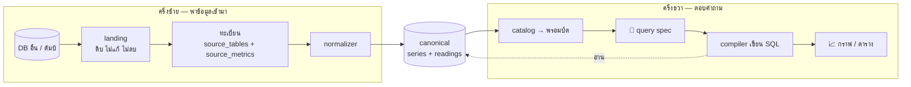
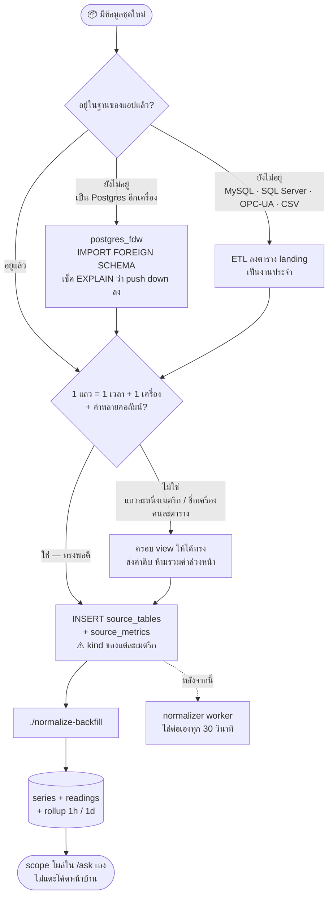
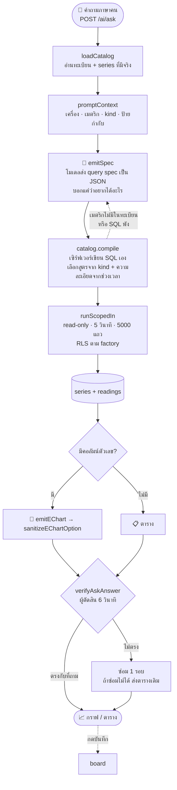

# llm2viz — เส้นทางเต็ม จากฐานข้อมูลอื่น ถึงกราฟบนจอ

เอกสารนี้เป็น **แผนที่** ไม่ใช่คู่มือลงมือ — มีไว้ให้เห็นว่ากล่องที่เรา INSERT ลงทะเบียนไป ไปโผล่ตรงไหนของคำตอบ พอจะลงมือจริงให้ข้ามไป [`onboarding-new-source.md`](onboarding-new-source.md)

---

## §0 ภาพเดียวจบ

**จุดต่อคือ `series` / `readings`** — ครึ่งซ้ายมีหน้าที่เดียวคือพาข้อมูลมาถึงตรงนั้น ครึ่งขวาไม่รู้จักอะไรก่อนหน้านั้นเลย ไม่รู้ว่าต้นทางเป็น MySQL หรือ CSV ไม่รู้ว่า landing ชื่ออะไร รู้แค่ว่ามี series อะไรบ้างและแต่ละอันเป็นเมตริกชนิดไหน

เพราะฉะนั้น **การเพิ่มฐานข้อมูลใหม่ไม่แตะครึ่งขวาเลย** และการแก้ครึ่งขวาก็ไม่ต้องรู้เรื่องต้นทาง

---

## §1 ครึ่งซ้าย — ข้อมูลเข้าระบบ

**สองอย่างที่ต้องจำ**

- `kind` คือช่องเดียวในทะเบียนที่ต้องคิดจริง ๆ — compiler เลือกสูตรรวมค่าจากช่องนี้ (`counter` → ผลต่าง · `gauge` → เฉลี่ยถ่วงน้ำหนัก · `event` → นับ · `state` → ค่าท้ายช่วง) ลงผิดแล้วคำตอบผิดแบบเงียบ ๆ ไม่มี error ให้เห็น
- `source_tables.reader` มีค่าเดียวคือ `'poll'` — **ข้อมูลต้องมาอยู่ในฐานของแอปเสมอ** normalizer ไม่ต่อออกไปข้างนอก

📖 ขั้นตอนจริง + SQL + กับดัก + วิธีถอย → [`onboarding-new-source.md`](onboarding-new-source.md) §0 มีตารางตัดสินว่าตกเคสไหน

---

## §2 ครึ่งขวา — คำถามกลายเป็นกราฟ

เส้นนี้คือเส้น `canonical` (`/ask/<slug ของโรงงาน>`) ส่วน `/ask/demo` เดินคนละเส้น — เทียบกันไว้ที่ [`onboarding-new-source.md` §"สองเส้นทาง"](onboarding-new-source.md)

**โมเดลไม่เคยเขียน SQL บนเส้นนี้** จึงไม่มีด่าน `validateSQL` — ไม่มี SQL จากภายนอกให้ตรวจ ค่าทุกตัวใน spec ถูก bind หมด และการรวมค่าผิดสูตร "เขียนออกมาไม่ได้" ตั้งแต่แรก

📖 รายละเอียดครบ — retry, ถามต่อเนื่อง, prose path, การเลือก bucket → [`ai-pages.md`](ai-pages.md) §2 (อังกฤษ)

---

## §3 กล่องไหนอยู่ไฟล์ไหน

| กล่อง | อยู่ที่ |
|---|---|
| ทะเบียน | ตาราง `source_tables` · `source_metrics` · `source_state` — สร้างใน `internal/migrate/migrate.go`, ตัวอย่างจริง `scripts/nj5-registry.sql` |
| normalizer — worker ทุก 30 วิ | `backend/internal/normalizer/` |
| normalizer — ลากดัมป์ครั้งเดียว | `backend/cmd/normalize-backfill/` |
| รายชื่อ scope ในตัวเลือก | `catalog.go:211` `ListScopes` → `GET /ai/scopes` |
| catalog → พรอมป์ต | `catalog.go:83` `loadCatalog` · `catalog.go:244` `promptContext` |
| โมเดลส่ง spec | `queryspec.go:69` `emitSpec` · `queryspec.go:134` `parseSpecEmission` |
| spec → SQL | `compiler.go:214` `catalog.compile` |
| รัน SQL | `nl2sql.go:203` `runScopedIn` |
| จุดเข้า `/ai/ask` | `nl2sql.go:1138` `AskData` |
| กราฟ | `nl2sql.go:684` `emitEChart` · `nl2sql.go:838` `sanitizeEChartOption` |
| ผู้ตัดสิน + ซ่อม | `nl2sql.go:784` `verifyAskAnswer` · `nl2sql.go:1430` `verifyAndRepairAnswer` |
| routes ทั้งหมด | `backend/internal/modules/ai/routes.go:29-38` |
| หน้าเว็บ + URL `/ask/:scope` | `frontend/src/pages/AskDataPage.vue` |

ทุกไฟล์ในตารางอยู่ใต้ `backend/internal/modules/ai/` ยกเว้นที่เขียน path เต็มไว้

---

## §4 อ่านต่อ

- [`onboarding-new-source.md`](onboarding-new-source.md) — คู่มือลงมือ 4 เคส + SQL จริง + วิธีถอย (ไทย)
- [`ai-pages.md`](ai-pages.md) — เจาะลึกทั้ง `/ask` และ `/ai` chat ครบทุกด่าน (อังกฤษ)
- [`../llm2viz/test-results.md`](../llm2viz/test-results.md) — ผลทดสอบสด + เรื่องโควตาโทเคน
