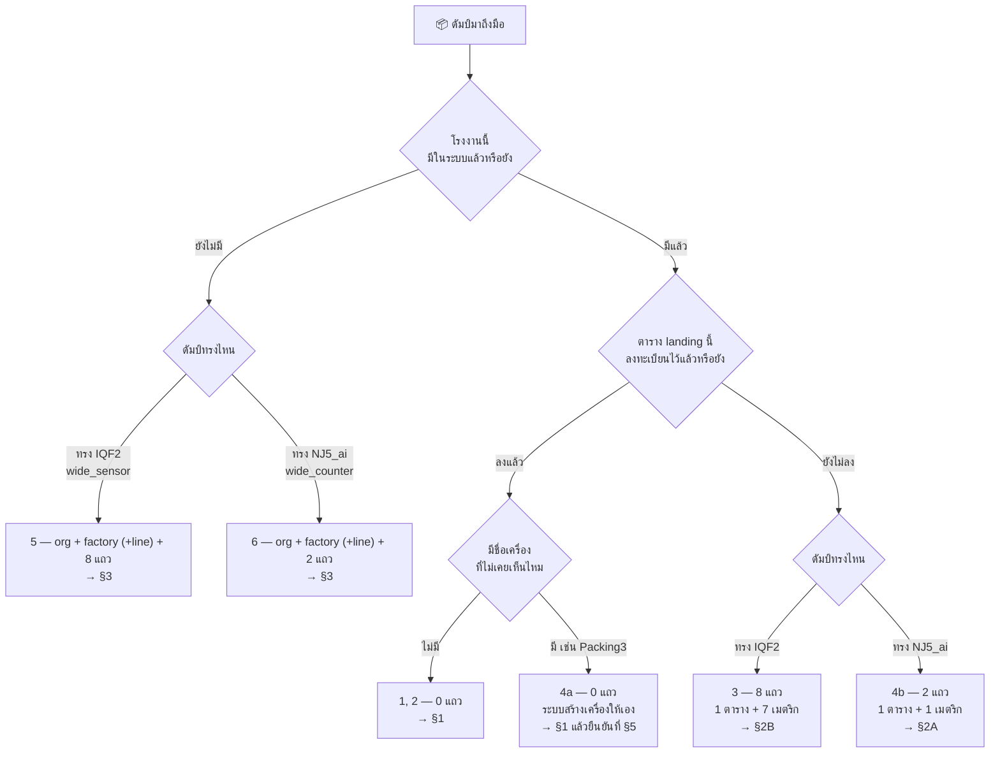
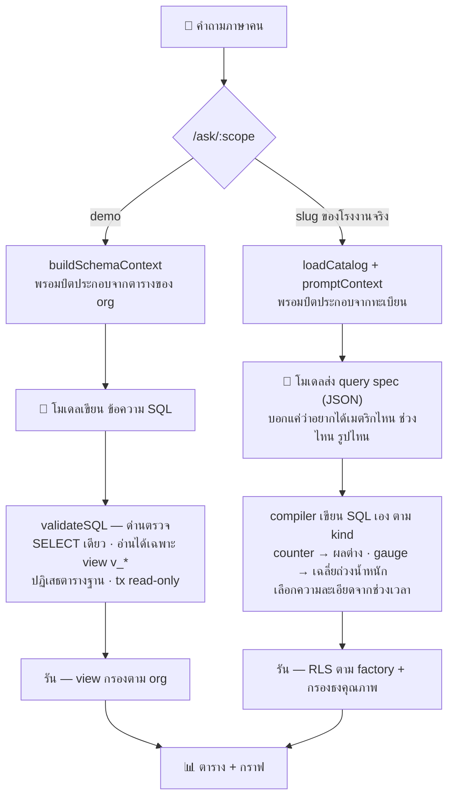

# รับข้อมูลชุดใหม่เข้าระบบ (Onboarding a new source)

คู่มือลงมือทำ สำหรับตอนที่มีดัมป์/ฐานข้อมูลใหม่มากองอยู่ตรงหน้า แล้วต้องทำให้ถามผ่าน `/ask` ได้

หลักการเดียวที่ต้องจำ: **ระบบไม่มีโค้ดต่อโรงงาน** วิธีอ่านต้นทางถูกเก็บเป็น *แถวในทะเบียน* (`source_tables` + `source_metrics`) แล้ว normalizer ทำงานตามนั้น เพราะฉะนั้นงานเกือบทั้งหมดในเอกสารนี้คือ INSERT ไม่ใช่การแก้โปรแกรม

> เอกสารที่เกี่ยวข้อง — `docs/iotvision-report/index.html` ข้อ 2.6 (ต่อ 3) ถึง (ต่อ 10) อธิบายเหตุผลเบื้องหลังดีไซน์นี้ · `scripts/nj5-registry.sql` คือทะเบียนจริงที่ใช้งานอยู่ ใช้เป็นตัวอย่างอ้างอิงได้เสมอ

---

## §0 เลือกเคสของคุณก่อน

ตอบ 3 คำถามนี้ แล้วข้ามไปอ่านเฉพาะหัวข้อของตัวเอง

**คำถามที่ 1 — โรงงานนี้มีอยู่ในระบบแล้วหรือยัง**

```sql
SELECT f.id, f.name, o.name AS org
FROM factories f JOIN organizations o ON o.id = f.organization_id
ORDER BY o.name, f.name;
```

**คำถามที่ 2 — ตารางต้นทาง 1 แถว หมายถึงอะไร**

ดูข้อมูลจริงสัก 5 แถว ถ้า **1 แถว = 1 จุดเวลา + 1 เครื่อง + ค่าหลายคอลัมน์** แปลว่า "ทรงพอดี" (wide) ใช้ได้เลย
ถ้า 1 แถวมีเมตริกเดียว (มีคอลัมน์ชื่อ tag/parameter) หรือชื่อเครื่องไม่ได้อยู่ในตารางนี้ แปลว่า "ทรงไม่พอดี"

**คำถามที่ 3 — ตารางต้นทางอยู่ในฐานข้อมูลเดียวกับแอปแล้วหรือยัง**

normalizer วิ่ง SQL ในฐานของแอปเท่านั้น ไม่ได้ต่อออกไปข้างนอก ถ้ายังอยู่ข้างนอกต้องดึงเข้ามาก่อน (§4C)

### ตารางตัดสิน

| | ทรงพอดี (wide) | ทรงไม่พอดี |
|---|---|---|
| **โรงงานเดิม** | ตารางเดิม → **เคส 1** (0 แถว)<br>ตารางใหม่ → **เคส 2** (2–8 แถว) | ครอบ view ตาม §4 ก่อน แล้วทำต่อแบบ **เคส 2** |
| **โรงงานใหม่** | **เคส 3** (3 + 1 + N แถว) | **เคส 4** (view 1 ตัว + เท่าเคส 3) |

"แถว" = จำนวนแถวที่ต้อง INSERT ลงทะเบียน ไม่ใช่จำนวนข้อมูล

### 6 สถานการณ์จริง → ต้องอ่าน § ไหน

ตารางข้างบนแบ่งตามทรงข้อมูล แต่คนที่ถือดัมป์อยู่ในมือมักคิดจาก "ไฟล์นี้หน้าตาเหมือนอันไหน" ก่อน ตารางนี้เข้าทางนั้น

> ⚠️ **สถานการณ์ 1-6 ในตารางนี้ คนละเลขกับ "เคส 1-4" ที่เป็นชื่อหัวข้อ §1-§4** ช่องขวาสุดคือตัวเชื่อม



| # | ดัมป์ทรงไหน | อะไรใหม่ | แถวทะเบียนที่ต้องเพิ่ม | อ่านที่ |
|---|---|---|---|---|
| 1 | `NJ5_machineIQF2.sql` — `wide_sensor` | ไม่มีอะไรใหม่ ตารางเดิม โรงงานเดิม | **0** | §1 |
| 2 | `NJ5_ai.sql` — `wide_counter` | ไม่มีอะไรใหม่ ตารางเดิม โรงงานเดิม | **0** | §1 |
| 3 | ทรง IQF2 | เครื่องใหม่ มาเป็น**ตารางใหม่** (เช่น IQF4) | **8** = 1 ตาราง + 7 เมตริก | §2B |
| 4a | ทรง NJ5_ai | เครื่องใหม่ อยู่**ในตารางเดิม** (เช่น `Packing3`) | **0** — ระบบสร้างเครื่องให้เอง | §1 แล้วยืนยันเครื่องที่ §5 |
| 4b | ทรง NJ5_ai | เครื่องใหม่ มาเป็น**ตารางใหม่** (เช่นอีกไลน์) | **2** = 1 ตาราง + 1 เมตริก | §2A |
| 5 | ทรง IQF2 | **โรงงานใหม่** | org + factory (+line) + 8 | §3 |
| 6 | ทรง NJ5_ai | **โรงงานใหม่** | org + factory (+line) + 2 | §3 |

**4a กับ 4b ต่างกันคนละเรื่อง และเป็นจุดที่พลาดกันบ่อยที่สุด**

- **4a — ชื่อเครื่องใหม่โผล่ในตารางที่ลงทะเบียนไว้แล้ว**: `resolveMachine` (`backend/internal/normalizer/normalizer.go:253`) เจอ `machine_name` ที่ไม่เคยเห็น จะสร้างแถว `machines` ให้เอง ติดธง `metadata.discovery` ไว้รอแอดมินยืนยันชื่อที่อ่านง่ายกว่า · **ไม่ต้องแตะทะเบียนเลยแม้แต่แถวเดียว** เพราะทะเบียนอธิบาย*ตาราง* ไม่ได้อธิบาย*เครื่อง*
- **4b — เครื่องใหม่มาเป็นตาราง landing คนละตาราง**: ระบบไม่รู้ว่าตารางนั้นมีอยู่ จนกว่าจะ INSERT `source_tables` ให้ · ไม่มีกลไกอัตโนมัติใด ๆ มาช่วยตรงนี้ เพราะไม่มีทางเดาได้ว่าคอลัมน์ไหนคือเวลา คอลัมน์ไหนคือค่า

ทั้ง 6 สถานการณ์ ถ้าเป็นข้อมูล**ย้อนหลัง** (ไม่ใช่ข้อมูลใหม่ต่อท้าย) ต้องรัน `normalize-backfill` ปิดท้ายเสมอ — อ่านหัวข้อถัดไป

### เครื่องมือที่จะใช้ตลอดทั้งเอกสาร — `normalize-backfill`

โปรแกรมแยกที่รันครั้งเดียวแล้วจบ (`backend/cmd/normalize-backfill/`) ทุกเคสด้านล่างจบด้วยคำสั่งนี้

```bash
cd backend && go run ./cmd/normalize-backfill
```

**ทำ 2 อย่าง**

1. **ระบายทุกต้นทางที่ลงทะเบียนไว้จนหมด** — อ่านทีละ batch (`batch_rows` ค่าเริ่มต้น 50,000) วนจนกว่าจะได้ batch ที่ไม่เต็ม แล้วเขียนลง `series` + `readings` · ตั้ง timeout ไว้ 6 ชั่วโมง เพราะดัมป์ระดับสิบล้านแถวใช้เวลาเป็นสิบนาทีขึ้นไป (NJ5 ทั้งชุด 21.6 ล้านแถว ใช้ 12 นาที 46 วินาที)
2. **รีเฟรชค่าสรุปรายชั่วโมงและรายวันทั้งช่วงเวลา** — `CALL refresh_continuous_aggregate('readings_1h'/'readings_1d', NULL, NULL)` เรียงรายชั่วโมงก่อนรายวัน เพราะรายวันคำนวณต่อจากรายชั่วโมง

**ทำไมต้องมี ทั้งที่เซิร์ฟเวอร์มี normalizer วิ่งทุก 30 วินาทีอยู่แล้ว**

เหตุผลอยู่ที่ข้อ 2 ทั้งหมด — normalizer ในเซิร์ฟเวอร์ดูดข้อมูลเข้า `readings` ให้อยู่แล้ว แต่นโยบายรีเฟรชอัตโนมัติของ TimescaleDB ครอบแค่ **7 วันล่าสุด** (รายชั่วโมง) และ **30 วันล่าสุด** (รายวัน) ข้อมูลที่เก่ากว่านั้นจะอยู่ในตารางครบทุกแถว แต่**ถามแล้วได้ศูนย์** เพราะคำถามช่วงกว้างอ่านจากค่าสรุป ไม่ได้อ่านจากข้อมูลดิบ

**ปลอดภัยแค่ไหน**

| คำถาม | คำตอบ |
|---|---|
| รันซ้ำได้ไหม | ได้ — เขียนแบบไม่ซ้ำคีย์ ข้อมูลเดิมถูกทิ้ง ไม่เกิดค่าซ้ำ |
| รันพร้อมเซิร์ฟเวอร์ที่กำลัง poll อยู่ได้ไหม | ได้ — จุดที่อ่านค้างไว้เดินหน้าอย่างเดียว ไม่ถอยกลับไปวนอ่านไม่จบ อย่างมากคืออ่านซ้ำแล้วถูกทิ้ง |
| ต้องหยุดระบบก่อนไหม | ไม่ต้อง |
| รันแล้วข้อมูลเดิมของโรงงานอื่นกระทบไหม | ไม่ — ไล่ต่อต้นทาง ต้นทางไหนพังบันทึกข้อผิดพลาดที่แถวของตัวเอง ต้นทางอื่นเดินต่อ |

**รันในคอนเทนเนอร์** (เส้นทางปกติเมื่อ deploy ด้วย Docker)

```bash
docker compose exec backend ./normalize-backfill
```

> ⚠️ **อย่าสับสนกับ `./backfill`** — คนละเครื่องมือกันโดยสิ้นเชิง · `backfill` เติมข้อมูลเทเลเมทรี**สาธิต** ลงชุดข้อมูล demo (`docker compose exec backend ./backfill` ที่อยู่ใน README) ไม่เกี่ยวกับทะเบียนหรือโรงงานจริงเลย · ตัวที่ต้องใช้ในเอกสารนี้คือ **`normalize-backfill`** เท่านั้น
>
> ถ้าอิมเมจถูก build ไว้ก่อน 2569-07-27 จะยังไม่มีไฟล์นี้ — `docker compose build backend` ใหม่หนึ่งครั้ง

---

## §1 เคส 1 — ตารางที่ลงทะเบียนแล้ว มีข้อมูลเพิ่ม

**สถานการณ์**: ดัมป์ก้อนใหม่ของ `nj5_machines` / `nj5_iqf2` / `nj5_iqf3` — โครงสร้างเดิม ข้อมูลใหม่

### ขั้นตอน (มีขั้นเดียว)

```bash
# ดัมป์เขียนว่า INSERT INTO public.machines ต้องเปลี่ยนชื่อเป็นตาราง landing ของเราก่อน
sed 's/public\.machines/nj5_machines/' NJ5_ai_batch2.sql | psql "$DATABASE_URL"

# ตู้แช่ก็แบบเดียวกัน
sed 's/public\.iqf2/nj5_iqf2/' NJ5_machineIQF2_batch2.sql | psql "$DATABASE_URL"
```

**แถวทะเบียนที่ต้องเพิ่ม: 0** — จบแค่นี้

### ทำไมถึงไม่ต้องทำอะไรอีก

| สิ่งที่เกิดขึ้นเอง | กลไก |
|---|---|
| ข้อมูลใหม่ถูกดูดเข้าภายใน 30 วินาที | normalizer อ่านต่อจาก `source_state.last_watermark` ทุกรอบ |
| เครื่องที่ไม่เคยเห็น (เช่น `Packing3`) ถูกสร้างให้ | `resolveMachine` สร้างเครื่อง ตั้งประเภทเป็น `Packing` แล้วเข้าคิว `/api/admin/machines/pending` |
| SKU / area ใหม่ แตกเป็นเส้นข้อมูลใหม่ | `label_exprs` ลงทะเบียนไว้แล้วเป็น `{"area":"area","sku":"sku_id"}` |
| โหลดทับของเดิมไม่พัง | เขียนด้วย `ON CONFLICT (series_id, ts) DO NOTHING` |
| อ่านซ้ำช่วงคาบเกี่ยว | `overlap_seconds = 300` ถอยหลัง 5 นาทีทุกรอบ เพื่อรับข้อมูลที่มาช้า |

### ข้อยกเว้นเดียวที่ต้องทำเพิ่ม

ถ้าดัมป์เป็นข้อมูล**ย้อนหลัง** ไม่ใช่ข้อมูลใหม่ต่อท้าย ต้องรีเฟรชค่าสรุปด้วย:

```bash
cd backend && go run ./cmd/normalize-backfill
```

เหตุผล: นโยบายรีเฟรชอัตโนมัติของ TimescaleDB ครอบแค่ **7 วันล่าสุด** (`readings_1h`) และ **30 วันล่าสุด** (`readings_1d`) ข้อมูลที่เก่ากว่านั้นจะอยู่ในตาราง `readings` ครบทุกแถว แต่**ถามแล้วได้ศูนย์** เพราะคำถามช่วงกว้างอ่านจากค่าสรุป

---

## §2 เคส 2 — เครื่อง/ตารางใหม่ในโรงงานเดิม

**สถานการณ์**: โรงงานเดิม (NJ5) แต่มาเป็นตารางที่ยังไม่เคยลงทะเบียน

หา `factory_id` ก่อน — ของ NJ5 คือ `00000000-0000-0000-0001-000000004046` (ตั้งไว้แบบคงที่ใน `scripts/nj5-registry.sql` เพื่อให้สคริปต์/เทสต์อ้างได้โดยไม่ต้อง lookup)

### 2A — ทรง `wide_counter` (แบบ `NJ5_ai.sql`)

ทุกเครื่องอยู่รวมตารางเดียว มีตัวนับสะสม

```sql
-- 1) โครงตาราง — ลอกคอลัมน์จากตารางเดิม
--    ใช้ LIKE เปล่า ๆ ไม่ใช่ INCLUDING ALL เพราะ INCLUDING ALL จะลอก index ของตารางเดิม
--    มาด้วย ทำให้ได้ index ซ้ำกับที่กำลังจะสร้างในขั้นที่ 3
CREATE TABLE nj5_machines_line2 (LIKE nj5_machines);

-- 2) โหลด
--    sed 's/public\.machines/nj5_machines_line2/' dump.sql | psql "$DATABASE_URL"

-- 3) index — ต้องเป็น EXPRESSION index ให้ตรงกับ ts_expr เป๊ะ ๆ
CREATE INDEX nj5_m_l2_ts ON nj5_machines_line2 (to_timestamp(time_stamp));

-- 4) ทะเบียนตาราง (1 แถว)
INSERT INTO source_tables (factory_id, table_name, shape, ts_expr, machine_expr,
                           label_exprs, overlap_seconds)
VALUES ('00000000-0000-0000-0001-000000004046', 'nj5_machines_line2', 'wide_counter',
        'to_timestamp(time_stamp)', 'machine_name',
        '{"area":"area","sku":"sku_id"}'::jsonb, 300)
ON CONFLICT (table_name) DO UPDATE
  SET ts_expr = EXCLUDED.ts_expr, machine_expr = EXCLUDED.machine_expr,
      label_exprs = EXCLUDED.label_exprs, overlap_seconds = EXCLUDED.overlap_seconds;

-- 5) เมตริก (1 แถว) — count_fg เท่านั้น
INSERT INTO source_metrics (source_table_id, column_name, field_key, kind, unit, llm_note)
SELECT id, 'count_fg', 'produced_count', 'counter', 'pieces',
       'Cumulative piece counter per (machine, area, sku). Output for a period is the delta.'
FROM source_tables WHERE table_name = 'nj5_machines_line2'
ON CONFLICT (source_table_id, column_name) DO UPDATE
  SET kind = EXCLUDED.kind, field_key = EXCLUDED.field_key,
      llm_note = EXCLUDED.llm_note, updated_at = NOW();

-- 6) แถวสถานะ
INSERT INTO source_state (source_table_id)
SELECT id FROM source_tables WHERE table_name = 'nj5_machines_line2'
ON CONFLICT (source_table_id) DO NOTHING;
```

**รวม 2 แถวที่มีสาระ** (+1 แถวสถานะที่ระบบสร้างเองได้)

### 2B — ทรง `wide_sensor` (แบบ `NJ5_machineIQF2.sql` เช่น IQF4 มาใหม่)

หนึ่งตารางต่อหนึ่งเครื่อง มีเซนเซอร์หลายคอลัมน์

```sql
-- 1) โครงตาราง (LIKE เปล่า ๆ — index สร้างเองในขั้นที่ 3)
CREATE TABLE nj5_iqf4 (LIKE nj5_iqf2);

-- 2) โหลด
--    sed 's/public\.iqf4/nj5_iqf4/' NJ5_machineIQF4.sql | psql "$DATABASE_URL"

-- 3) index — บน created_at_ts ตรง ๆ (ไม่ใช่ time_stamp — ดูกับดักข้อ 1 ด้านล่าง)
CREATE INDEX nj5_iqf4_ts ON nj5_iqf4 (created_at_ts);

-- 4) ทะเบียนตาราง (1 แถว)
--    machine_expr เป็นค่าคงที่ ไม่ใช่ machine_name — ดูกับดักข้อ 3
INSERT INTO source_tables (factory_id, table_name, shape, ts_expr, machine_expr,
                           label_exprs, overlap_seconds)
VALUES ('00000000-0000-0000-0001-000000004046', 'nj5_iqf4', 'wide_sensor',
        'created_at_ts', '''IQF4''', '{}'::jsonb, 300)
ON CONFLICT (table_name) DO UPDATE
  SET ts_expr = EXCLUDED.ts_expr, machine_expr = EXCLUDED.machine_expr;

-- 5) เมตริก 7 แถว — ลอกทั้งชุดจาก iqf2 ไม่ต้องพิมพ์ใหม่และไม่มีโอกาสพิมพ์ผิด
INSERT INTO source_metrics (source_table_id, column_name, value_expr, field_key, kind,
                            unit, sentinel, valid_min, valid_max, llm_note)
SELECT new.id, m.column_name, m.value_expr, m.field_key, m.kind,
       m.unit, m.sentinel, m.valid_min, m.valid_max, m.llm_note
FROM source_metrics m
JOIN source_tables old ON old.id = m.source_table_id AND old.table_name = 'nj5_iqf2'
CROSS JOIN (SELECT id FROM source_tables WHERE table_name = 'nj5_iqf4') new
ON CONFLICT (source_table_id, column_name) DO NOTHING;

-- 6) แถวสถานะ
INSERT INTO source_state (source_table_id)
SELECT id FROM source_tables WHERE table_name = 'nj5_iqf4'
ON CONFLICT (source_table_id) DO NOTHING;
```

**รวม 8 แถว** (1 ตาราง + 7 เมตริก)

จากนั้นทั้ง 2A และ 2B รัน:

```bash
cd backend && go run ./cmd/normalize-backfill
```

### กับดัก 7 ข้อของเคสนี้ — ทุกข้อมาจากดัมป์จริง ไม่ใช่สมมติ

| # | กับดัก | ของจริง | ต้องทำ |
|---|---|---|---|
| 1 | เลือกคอลัมน์เวลาผิด | ตู้แช่: `time_stamp` = `1753203806316` (epoch **มิลลิวินาที**) · `created_at` = epoch วินาที แต่มีค่าแค่ ~3% ของแถว · `created_at_ts` มีครบทุกแถว | ตู้แช่ใช้ `created_at_ts` · ตารางผลิตใช้ `to_timestamp(time_stamp)` (epoch **วินาที**) |
| 2 | index ไม่ตรงกับนิพจน์ | ตัวอ่านกรองด้วย `WHERE (ts_expr) > $1` ตรง ๆ | ถ้า `ts_expr` เป็นนิพจน์ index ต้องเป็น expression index ที่เขียนเหมือนกันทุกตัวอักษร |
| 3 | ใส่ `machine_expr` เป็น `machine_name` | ตารางตู้แช่เก็บ `'IQF_2'` แต่ตารางผลิตเรียกเครื่องเดียวกันว่า `'IQF2'` | ใส่ค่าคงที่ `'IQF4'` → ชี้ไปเครื่องเดียวกับตัวนับผลิต ถาม "อุณหภูมิเทียบยอดผลิตของ IQF4" จึงได้ 2 เส้นของเครื่องเดียว ไม่ใช่ join ข้ามตาราง |
| 4 | ลงทะเบียน `count_ng` | เป็น 0 ทุกแถวในดัมป์ | ไม่ลงทะเบียน — การไม่ลงทะเบียนคือวิธีบอกว่า "โรงงานนี้ไม่มีข้อมูลของเสีย" โมเดลจะขอไม่ได้เลย |
| 5 | ลงทะเบียน `rail_temp` | NULL ทุกแถว | ไม่ลงทะเบียน (ชุดที่ลอกจาก iqf2 ไม่มีอยู่แล้ว) |
| 6 | ลืม sentinel ของ `freezing_time` | `9999.0` แปลว่า "ไม่มีค่า/เครื่องว่าง" ไม่ใช่ 9999 วินาที | ลงทะเบียน `sentinel = 9999` → ระบบติดธง 1 และกรองออกตอนตอบ โดยยังเก็บค่าดิบไว้ |
| 7 | `fail_network` เป็น boolean | `false` / `true` อ่านเป็นตัวเลขไม่ได้ | `value_expr = 'fail_network::int'` และ `kind = 'event'` เพื่อให้นับจำนวนครั้งที่หลุดเน็ตได้ |

---

## §3 เคส 3 — โรงงานใหม่ ทรงพอดี

**สถานการณ์**: โรงงานที่ยังไม่มีในระบบ ส่งตารางที่ 1 แถว = 1 เวลา + 1 เครื่อง + ค่าหลายคอลัมน์

### ลำดับที่ห้ามสลับ

`organizations` → `factories` → *(ไม่บังคับ)* `production_lines` → ตาราง landing → index → `source_tables` → `source_metrics` → `source_state` → backfill

เหตุผลที่สลับไม่ได้: `source_tables.factory_id` มี FK ไปที่ `factories` และตัวอ่านจะพยายาม `SELECT` จากตาราง landing ทันทีที่ลงทะเบียนเสร็จ

```sql
-- ── 1) องค์กร + โรงงาน ──────────────────────────────────────────────
-- ถ้าเป็นโรงงานขององค์กรที่มีอยู่แล้ว ข้าม INSERT organizations ไปใช้ id เดิม
INSERT INTO organizations (id, name, slug, plan)
VALUES ('00000000-0000-0000-0000-000000005000', 'CPF Bangna', 'cpf-bangna', 'enterprise')
ON CONFLICT (id) DO NOTHING;

INSERT INTO factories (id, organization_id, name, location, timezone, slug)
VALUES ('00000000-0000-0000-0001-000000005000',
        '00000000-0000-0000-0000-000000005000',
        'Bangna2', 'Bangna, Samut Prakan', 'Asia/Bangkok', 'bn2')
ON CONFLICT (id) DO UPDATE SET slug = EXCLUDED.slug;

-- ตั้ง id เองแบบคงที่ (ไม่ปล่อยให้ gen_random_uuid) จะอ้างในสคริปต์อื่นได้โดยไม่ต้อง lookup
-- timezone มีผลจริง — ถูกใส่ลงพรอมป์ตและใช้ตีความคำว่า "เมื่อวาน" ของผู้ถาม
-- slug คือชื่อโรงงานบน URL — แถวนี้ทำให้หน้าถามข้อมูลของโรงงานนี้อยู่ที่ /ask/bn2
--   ไม่ใส่ก็ได้ migration จะเดาจาก name ให้ ('Bangna2' → 'bangna2') แต่ตั้งเองสั้นกว่า
--   ไม่ต้องแก้อะไรฝั่ง frontend เลย — /ask/:scope resolve จาก GET /ai/scopes

-- ── 2) สายการผลิต (ไม่บังคับ) ────────────────────────────────────────
-- ไม่ใส่ก็ได้ normalizer จะสร้าง 'Auto' / 'AUTO' ให้เองตอนเจอเครื่องแรก
INSERT INTO production_lines (id, factory_id, name, code, status)
VALUES ('00000000-0000-0000-0002-000000005000',
        '00000000-0000-0000-0001-000000005000', 'BN2 Main', 'BN2', 'active')
ON CONFLICT (id) DO NOTHING;

-- ── 3) ตาราง landing + index ────────────────────────────────────────
CREATE TABLE bn2_oven (
  ts          timestamptz,
  device_code text,
  zone_temp   real,
  belt_speed  real,
  total_count bigint
);
-- โหลดข้อมูลเข้าตารางนี้ (psql / COPY / ETL) แล้วค่อยสร้าง index ทีหลัง
CREATE INDEX bn2_oven_ts ON bn2_oven (ts);

-- ── 4) ทะเบียนตาราง ─────────────────────────────────────────────────
INSERT INTO source_tables (factory_id, table_name, shape, ts_expr, machine_expr,
                           label_exprs, overlap_seconds, batch_rows)
VALUES ('00000000-0000-0000-0001-000000005000', 'bn2_oven', 'wide_sensor',
        'ts', 'device_code', '{}'::jsonb, 300, 50000);

-- ── 5) ทะเบียนเมตริก ────────────────────────────────────────────────
INSERT INTO source_metrics (source_table_id, column_name, field_key, kind, unit,
                            sentinel, valid_min, valid_max, llm_note)
SELECT id, v.* FROM source_tables st,
LATERAL (VALUES
  ('zone_temp',   'zone_temp',      'gauge',   '°C',     NULL::float, -10.0,  400.0,
   'Oven zone temperature. Normal band 170-190.'),
  ('belt_speed',  'belt_speed',     'gauge',   NULL,     NULL,          0.0, 1000.0,
   'Conveyor speed; 0 means the line is stopped.'),
  ('total_count', 'produced_count', 'counter', 'pieces', NULL,         NULL,   NULL,
   'Cumulative piece counter. Output for a period is the delta, never a sum.')
) AS v(column_name, field_key, kind, unit, sentinel, valid_min, valid_max, llm_note)
WHERE st.table_name = 'bn2_oven';

-- ── 6) แถวสถานะ ─────────────────────────────────────────────────────
INSERT INTO source_state (source_table_id)
SELECT id FROM source_tables WHERE table_name = 'bn2_oven';
```

```bash
cd backend && go run ./cmd/normalize-backfill
```

### เลือก `kind` ให้ถูก — ช่องเดียวที่ต้องคิดจริง ๆ

| `kind` | ใช้เมื่อ | เซิร์ฟเวอร์จะคำนวณ | เลือกผิดแล้วเป็นอย่างไร |
|---|---|---|---|
| `counter` | ตัวนับสะสมที่วิ่งขึ้นเรื่อย ๆ ไม่รีเซ็ตตามรอบ | ค่าสุดท้าย − ค่าแรกของช่วง (รีเซ็ตแล้วตัดเป็นศูนย์) | ใส่ `gauge` → ได้ค่าเฉลี่ยของยอดสะสม ไร้ความหมายโดยสิ้นเชิง |
| `gauge` | ค่าวัด ณ ขณะนั้น (อุณหภูมิ ความเร็ว แรงดัน) | เฉลี่ยถ่วงน้ำหนัก `SUM(sum)/SUM(n)` | ใส่ `counter` → ได้ผลต่างอุณหภูมิหัว-ท้ายช่วง ดูเหมือนตัวเลขจริงแต่ผิด |
| `event` | ธงว่าเกิดเหตุ (หลุดเน็ต แจ้งเตือน) | นับจำนวนครั้ง (SUM) | ใส่ `gauge` → ได้ "ค่าเฉลี่ยของการหลุดเน็ต" |
| `state` | สถานะ/โหมดที่คงอยู่จนกว่าจะเปลี่ยน | ค่าสุดท้ายของช่วง | ใส่ `gauge` → เฉลี่ยรหัสสถานะเข้าด้วยกัน |

> `kind` ไม่ได้เป็นแค่คำอธิบาย — โมเดล **ไม่มีช่องให้สั่งวิธีรวมค่า** เซิร์ฟเวอร์อ่านจากช่องนี้ช่องเดียว การรวมค่าผิดชนิดจึงเขียนออกมาไม่ได้เลย

### อะไรเกิดขึ้นเองหลังลงทะเบียนเสร็จ

| เกิดอะไร | ที่มา |
|---|---|
| โรงงานใหม่โผล่ในตัวเลือกชุดข้อมูลของหน้า /ask | `GET /ai/scopes` ไล่ `factories JOIN source_tables … enabled` |
| พรอมป์ตชุดใหม่ถูกสร้างให้รอบถัดไป | แคชผูกกับ `max(source_metrics.updated_at)` + จำนวนเมตริก + จำนวนเส้นข้อมูล |
| เครื่องทุกตัวถูกสร้างจากข้อมูลจริง | `resolveMachine` สร้างตอนเจอชื่อครั้งแรก ติดธง `discovery=auto` |
| ชื่อเครื่องถูกยุบเป็น "ตระกูล" | `machineType()` ตัดตัวเลข/`_`/`-` ท้ายชื่อ (`OVEN_01` → `OVEN`) ทำให้พรอมป์ตโตตามจำนวนชนิด ไม่ใช่จำนวนเครื่อง |
| ขอบเขตข้อมูลถูกบังคับที่ฐานข้อมูล | RLS บน `series` อ่าน `app.factory`; ไม่ตั้ง = 0 แถว |

**สิ่งที่ไม่ต้องแตะเลย**: โค้ด Go · ข้อความพรอมป์ต · รายการ view ที่อนุญาต (`allowedViews` มี 5 ชื่อคงที่ ไม่โตตามจำนวนโรงงาน) · โค้ด frontend

---

## §4 เคส 4 — โรงงานใหม่ ทรงไม่พอดี

ทำ view บาง ๆ ครอบให้เป็นทรง wide ก่อน **แล้วลงทะเบียนชื่อ view แทนชื่อตาราง** — ตัวอ่านใช้ `pgx.Identifier{}.Sanitize()` กับชื่อที่ลงทะเบียน จึงรับ view ได้เหมือนตารางปกติ จากนั้นทำต่อตาม §3 ทุกขั้น

### 4A — แถวละหนึ่งเมตริก (EAV / long format)

```sql
-- ต้นทาง: plant3_tags(recorded_at, device_code, tag_name, tag_value)
--   2026-07-20 08:00:00 | OVEN_01 | ZONE_T   |    182.4
--   2026-07-20 08:00:00 | OVEN_01 | TOTAL_CT | 148920.0

-- index บนตารางฐาน ต้องมีก่อน — view สืบทอด index ของตารางข้างล่างไม่ได้ถ้าเงื่อนไข push down ไม่ลง
CREATE INDEX plant3_tags_ts  ON plant3_tags (recorded_at);
CREATE INDEX plant3_tags_dev ON plant3_tags (device_code, tag_name);

CREATE VIEW v_plant3 AS
SELECT recorded_at AS ts,
       device_code,
       MAX(tag_value) FILTER (WHERE tag_name = 'ZONE_T')   AS zone_temp,
       MAX(tag_value) FILTER (WHERE tag_name = 'TOTAL_CT') AS total_count
FROM plant3_tags
GROUP BY 1, 2;
```

**ข้อควรระวัง** — `GROUP BY` ทำให้ planner อาจไม่ส่งเงื่อนไข `WHERE ts > $1` ลงไปที่ตารางฐาน ตรวจก่อนใช้จริง:

```sql
EXPLAIN (ANALYZE, BUFFERS)
SELECT * FROM v_plant3 WHERE ts > now() - interval '1 hour' ORDER BY ts LIMIT 50000;
-- ต้องเห็น Index Scan / Index Only Scan บน plant3_tags
-- ถ้าเห็น Seq Scan บนตารางเป็นล้านแถว → อย่าใช้ view นี้ ให้ทำ materialized view
--   ที่ REFRESH เป็นรอบแทน แล้วสร้าง unique index บน (ts, device_code)
```

ถ้าค่าซ้ำได้ในหนึ่ง (เวลา, เครื่อง, tag) `MAX()` จะเลือกค่าสูงสุดเงียบ ๆ — ตัดสินใจให้ชัดว่าต้องการ `MAX`, `MIN` หรือ `last(value, ts)`

### 4B — ชื่อเครื่องอยู่คนละตาราง

```sql
CREATE VIEW v_plant4 AS
SELECT r.recorded_at AS ts,
       d.device_name,          -- มาจากตารางค้นหา
       r.temp_c,
       r.pressure_bar
FROM plant4_readings r
JOIN plant4_devices  d ON d.id = r.device_id;
```

ฝั่งที่ join เข้ามาต้องเป็น**ตารางค้นหาเล็ก ๆ** (ไม่กี่ร้อยแถว) ห้าม join ตารางค่าอีกก้อนเข้าด้วยกัน เพราะตัวอ่านวิ่งทุก 30 วินาที
ทางเลือกที่ถูกกว่าถ้า lookup ไม่ค่อยเปลี่ยน: ไม่ต้อง join เลย ใส่ `machine_expr` เป็น `device_id::text` แล้วเปลี่ยนชื่อให้อ่านง่ายทีหลังด้วย `POST /api/admin/machines/:id/confirm {name}`

### 4C — อยู่คนละเซิร์ฟเวอร์ / คนละชนิดฐานข้อมูล

**ถ้าเป็น PostgreSQL อีกเครื่อง** — ใช้ foreign table

```sql
CREATE EXTENSION IF NOT EXISTS postgres_fdw;

CREATE SERVER plant5_srv FOREIGN DATA WRAPPER postgres_fdw
  OPTIONS (host 'plant5.internal', port '5432', dbname 'scada',
           fetch_size '50000', use_remote_estimate 'true');

CREATE USER MAPPING FOR CURRENT_USER SERVER plant5_srv
  OPTIONS (user 'readonly', password '***');

IMPORT FOREIGN SCHEMA public LIMIT TO (oven_readings)
  FROM SERVER plant5_srv INTO public;
```

ตรวจให้แน่ใจว่าเงื่อนไขถูกส่งไปกรองที่ต้นทาง ไม่ใช่ดึงมาทั้งตารางแล้วค่อยกรอง:

```sql
EXPLAIN (VERBOSE)
SELECT * FROM oven_readings WHERE recorded_at > now() - interval '1 hour';
-- ต้องเห็น Remote SQL ที่มี WHERE ติดไปด้วย
```

ถ้า push down ไม่ลง อย่าฝืน — ให้ sync ลงตาราง landing ของเราแทน

**ถ้าไม่ใช่ PostgreSQL** (MySQL / SQL Server / OPC-UA / CSV) — ETL ลงตาราง landing เป็นงานประจำ แล้วทำต่อเหมือน §3 ทุกประการ
คอลัมน์ `source_tables.reader` มีค่าเริ่มต้น `'poll'` และเผื่อไว้สำหรับตัวอ่านแบบ push ในอนาคต แต่วันนี้มีแค่ `poll` ตัวเดียว — ข้อมูลต้องมาอยู่ในฐานของแอปเสมอ

### กติกา 6 ข้อของ view ที่ normalizer จะอ่านได้

| # | กติกา | ผิดแล้วเกิดอะไร |
|---|---|---|
| 1 | เงื่อนไข `WHERE (ts_expr) > $1 ORDER BY 1 LIMIT n` ต้องลง index | ตัวอ่านยิงทุก 30 วินาที = สแกนทั้งตารางทุกครึ่งนาที |
| 2 | ห้ามรวมค่าล่วงหน้า | ⬇ ดูตัวอย่างด้านล่าง |
| 3 | ห้ามกรอง sentinel / ค่านอกช่วง | ธงคุณภาพต้องได้ค่าดิบไปตั้ง กรองใน view แล้วจะแก้ทะเบียนย้อนหลังไม่ได้ ต้องนำเข้าใหม่ |
| 4 | 1 แถวต่อ 1 (เวลา, เครื่อง, ชุดป้ายกำกับ) | ค่าที่ซ้ำคีย์จะถูกทิ้ง**เงียบ ๆ** ไม่มีข้อผิดพลาดให้เห็น |
| 5 | ป้ายกำกับต้องมีค่าไม่หลากหลาย | ค่าไปโผล่ในพรอมป์ต (จำกัด 30 ค่า) และแตก `series` หนึ่งแถวต่อหนึ่งชุด |
| 6 | materialized view ต้องมี unique index + ตั้งรอบรีเฟรช | ข้อมูลค้างโดยไม่มีสัญญาณเตือน |

ตัวอย่างของกติกาข้อ 2:

```sql
-- ❌ ผิด — รวมค่าล่วงหน้าใน view
CREATE VIEW v_bad AS
SELECT time_bucket('1 hour', ts) AS ts, device_code,
       MAX(counter) - MIN(counter) AS produced   -- ยอดที่คร่อมขอบชั่วโมงหายทุกชั่วโมง
FROM src GROUP BY 1, 2;                          -- และตรวจไม่ได้ว่าตัวนับถูกรีเซ็ต

-- ✅ ถูก — ส่งค่าดิบไป แล้วประกาศว่าเป็น counter
CREATE VIEW v_good AS SELECT ts, device_code, counter FROM src;
-- ระบบจะเก็บ first/last ของแต่ละช่วงให้เอง แล้วคำนวณผลต่างตอนตอบ
```

---

## §5 ตรวจหลังทำ

### ⚠️ ต้องตั้งขอบเขตก่อนทุกครั้ง

```sql
SET app.factory = '00000000-0000-0000-0001-000000005000';
```

`series` เปิด FORCE row-level security อ่านค่าจาก `app.factory` — **ไม่ตั้งแล้วทุก query ด้านล่างจะคืน 0 แถว** ซึ่งเป็นพฤติกรรมที่ตั้งใจ (fail closed) ไม่ใช่ข้อมูลหาย

### 1. เส้นข้อมูลที่เกิดขึ้น

```sql
SELECT s.field_key, count(*) AS series, min(s.first_seen)::date AS first_seen
FROM series s GROUP BY 1 ORDER BY 2 DESC;
```

คาดหวังหลักสิบถึงหลักร้อย ถ้าได้หลักพัน/หลักหมื่นแปลว่าลงทะเบียนคอลัมน์ที่มีค่าหลากหลายเป็น label ไปโดยไม่ตั้งใจ

### 2. สัดส่วนธงคุณภาพ

```sql
SELECT s.field_key, r.quality, count(*) AS readings
FROM readings r JOIN series s ON s.id = r.series_id
GROUP BY 1, 2 ORDER BY 1, 2;
```

`0` = ปกติ · `1` = ตรงกับ sentinel · `2` = นอกช่วงที่ยอมรับ
ธง 2 เยอะผิดปกติ = `valid_min/max` ตั้งแคบไป · ธง 1 เป็น 0 ทั้งที่รู้ว่ามี sentinel = ยังไม่ได้ลงทะเบียน sentinel

### 3. สถานะการนำเข้า

```sql
SELECT st.table_name, ss.last_watermark, ss.rows_ingested, ss.last_error
FROM source_tables st JOIN source_state ss ON ss.source_table_id = st.id
ORDER BY 1;
```

`last_error` ต้องเป็น NULL ทุกแถว และ `last_watermark` ต้องขยับทุกครั้งที่ดู

### 4. ตรวจผ่าน API (ต้องเป็น role `admin`)

| เส้นทาง | ดูอะไร |
|---|---|
| `GET /api/admin/sources` | สถานะเดียวกับข้อ 3 ในรูปแบบ JSON |
| `GET /api/admin/sources/drift` | ทะเบียนยังตรงกับคอลัมน์จริงหรือไม่ — `missing` / `retyped` / `unregistered` / `tableMissing` |
| `GET /api/admin/machines/pending` | เครื่องที่ระบบสร้างเอง รอตั้งชื่อ |
| `POST /api/admin/machines/:id/confirm` | ยืนยัน พร้อมตั้ง `{name, type}` ที่อ่านง่ายกว่ารหัสจากโรงงาน |

### 5. ทดสอบปลายทางจริง

เปิดหน้า `/ask` เลือกโรงงานใหม่ แล้วถาม 2 คำถาม

1. คำถามที่ต้องใช้ `counter` — "ยอดผลิต 7 วันล่าสุดของ OVEN_01" → ต้องได้ผลต่างสะสม ไม่ใช่ผลบวกของค่าดิบ
2. คำถามที่ต้องใช้ `gauge` — "อุณหภูมิเฉลี่ยรายวันสัปดาห์นี้" → ต้องได้ค่าอยู่ในย่านที่สมเหตุสมผล

ถ้าตัวเลขดูแปลก ให้กลับไปดู `kind` ก่อนอย่างอื่นเสมอ

---

## §6 ถอยกลับ / แก้ที่ลงทะเบียนผิด

### หยุดรับต้นทางชั่วคราว

```sql
UPDATE source_tables SET enabled = false WHERE table_name = 'bn2_oven';
```

ต้นทางอื่นไม่กระทบ ข้อมูลที่นำเข้าไปแล้วยังตอบได้ตามปกติ เปิดกลับเมื่อไรก็อ่านต่อจาก watermark เดิม

### ลบทะเบียนทิ้ง

```sql
DELETE FROM source_tables WHERE table_name = 'bn2_oven';
-- cascade ลบ source_metrics และ source_state ให้เอง
```

**แต่ `series` และ `readings` ที่สร้างไปแล้วไม่หาย** — ยังถูกถามถึงได้ ถ้าต้องการล้างจริง:

```sql
SET app.factory = '<factory_id>';
DELETE FROM series WHERE factory_id = '<factory_id>' AND field_key = 'zone_temp';
-- readings ถูกลบตาม ON DELETE CASCADE
```

### แก้ `kind` ที่ลงทะเบียนผิดหลังนำเข้าไปแล้ว

```sql
UPDATE source_metrics SET kind = 'counter', updated_at = NOW()
WHERE field_key = 'produced_count';
```

มีผล**ทันทีในรอบถามถัดไป** เพราะสูตรถูกเลือกตอนคอมไพล์คำสั่ง ไม่ได้ฝังอยู่ในข้อมูล ไม่ต้องนำเข้าใหม่

### แก้ `sentinel` / `valid_min` / `valid_max` หลังนำเข้าไปแล้ว

ต่างจาก `kind` — ธงคุณภาพถูกคำนวณและเขียนลงแถว**ตอนนำเข้า** แก้ทะเบียนแล้วแถวเก่ายังถือธงเดิมอยู่

```sql
UPDATE source_metrics SET sentinel = 9999, updated_at = NOW()
WHERE field_key = 'freezing_time';

-- ต้องนำเข้าใหม่ให้ธงถูกต้อง: ถอย watermark กลับไปจุดที่ต้องการ
UPDATE source_state SET last_watermark = '2026-01-01T00:00:00Z'
WHERE source_table_id = (SELECT id FROM source_tables WHERE table_name = 'nj5_iqf4');
```

แต่ `ON CONFLICT DO NOTHING` จะไม่เขียนทับแถวที่มีอยู่ ถ้าต้องการให้ธงเก่าถูกจริง ๆ ต้องลบ `readings` ของช่วงนั้นก่อนแล้วค่อยรัน backfill ใหม่ — ประเมินก่อนว่าคุ้มไหม เพราะการกรองตอนตอบใช้ธงในค่าสรุปซึ่งจะถูกคำนวณใหม่อยู่แล้วเมื่อรีเฟรช

---

## §7 ข้อจำกัดที่ต้องปิดก่อน ถ้าโรงงานใหม่เป็นคนละองค์กร

**ตอนนี้ระบบยังไม่ตรวจว่า `factoryId` ที่ผู้เรียกส่งมาเป็นของ organization ผู้ใช้จริงหรือไม่**

- `askHandler` รับ `body.factoryId` เข้า scope ตรง ๆ (`internal/modules/ai/nl2sql.go`)
- `runScopedIn` เอาค่านั้นไปตั้ง `app.factory` โดยไม่เทียบกับ `factories.organization_id` ของผู้ใช้
- `ListScopes` (`internal/modules/ai/catalog.go`) ไล่ทุกโรงงานที่มีต้นทางเปิดใช้ ไม่ได้กรองตาม organization เช่นกัน

RLS ทำหน้าที่ของมันถูกต้อง — บังคับว่า **หนึ่งคำถามเห็นได้โรงงานเดียว** — แต่ไม่ได้บังคับว่าโรงงานนั้นต้องเป็นของผู้ใช้

ผลกระทบวันนี้เป็นศูนย์ เพราะมีโรงงานจริงโรงเดียว แต่**จะกลายเป็นช่องรั่วทันทีที่มีโรงงานของคนละองค์กรอยู่ในฐานเดียวกัน** ซึ่งคือสิ่งที่ §3 และ §4 กำลังจะทำ

**ก่อนรับโรงงานข้ามองค์กรจริง ต้องเพิ่ม guard**: ตรวจ `factories.organization_id = <org ของผู้ใช้>` ก่อนตั้ง `app.factory` และกรอง `ListScopes` ด้วย organization เดียวกัน

ถ้าเป็นโรงงานใหม่ของ**องค์กรเดิม** ประเด็นนี้ไม่มีผล ใช้ `organization_id` เดิมได้เลย

---

## §8 ข้อมูลสด (real-time) แทนการโหลดดัมป์

ทุกเคสข้างบนเขียนจากมุมของดัมป์ แต่**ระบบออกแบบมาสำหรับข้อมูลไหลต่อเนื่องตั้งแต่แรก** — ถ้าแถวใหม่ไปโผล่ในตาราง landing เรื่อย ๆ normalizer ในเซิร์ฟเวอร์ดูดเข้าให้เองทุก 30 วินาที ไม่ต้องรัน `normalize-backfill` ซ้ำ ๆ (เครื่องมือนั้นมีไว้สำหรับข้อมูล**ย้อนหลัง**เท่านั้น)

### หน่วงเวลาจริง

| ช่วง | เวลา |
|---|---|
| แถวใหม่ไปอยู่ในตาราง landing → normalizer อ่าน | ≤ 30 วินาที |
| normalizer เขียนลง `readings` | ทันที |
| ถามผ่าน `/ask` แล้วเห็น | ทันที |
| **รวม** | **ไม่เกิน ~30 วินาที** |

ที่เห็นทันทีเพราะสองอย่าง — คำถามช่วงแคบกว่า 1 ชั่วโมงอ่านจากข้อมูลดิบตรง ๆ และค่าสรุปรายชั่วโมง/รายวันตั้ง `materialized_only = false` ไว้ จึงเอาแถวที่ใหม่กว่ารอบคำนวณล่าสุดมารวมให้อัตโนมัติ ไม่ต้องรอรีเฟรช (ถ้าไม่ตั้งค่านี้ คำถาม "ชั่วโมงล่าสุด" จะได้ 0 ซึ่งดูเหมือนเครื่องหยุดเดิน)

### 4 วิธีป้อนข้อมูลสด

| วิธี | ต้องแก้โค้ดไหม | เหมาะกับ |
|---|---|---|
| 1. โรงงานเขียนลงตาราง landing โดยตรง | ไม่ | ดีที่สุดถ้าคุมฝั่งโรงงานได้ |
| 2. `postgres_fdw` ต่อไปฐานของโรงงาน (§4C) | ไม่ | โรงงานมี PostgreSQL อยู่แล้ว · ⚠️ ต้อง `EXPLAIN` ยืนยันว่าเงื่อนไขเวลาถูกส่งไปกรองที่ต้นทาง ไม่งั้นดึงทั้งตารางทุก 30 วินาที |
| 3. ETL/สคริปต์ sync ต่อท้ายตาราง landing | ไม่ | ต้นทางไม่ใช่ PostgreSQL (MySQL, SQL Server, OPC-UA, MQTT) |
| 4. ให้อุปกรณ์ push เข้ามาตรง ๆ | **ใช่** | มีโครงรองรับแล้ว (`source_tables.reader` ค่าเริ่มต้น `'poll'` + interface `reader` ใน `normalizer/reader.go`) แต่มีตัวอ่านแบบ poll ตัวเดียว ต้องเขียนเพิ่ม |

วิธี 1–3 ใช้ได้เลยโดยไม่แตะโค้ด งานทั้งหมดอยู่นอกระบบ — แค่ทำให้แถวไปโผล่ในตาราง landing

### ⚠️ ข้อจำกัดสำคัญ — ข้อมูลสดเข้ามาแล้ว "ยังไม่ครบทุกหน้าจอ"

ระบบมีเส้นทางข้อมูลสด **2 เส้นที่แยกกันอยู่** และเส้น canonical ยังไม่ต่อเข้ากับ WebSocket

| ความสามารถ | เส้นเดิม `telemetry_raw` | เส้น canonical `readings` |
|---|---|---|
| เข้าทาง | อุปกรณ์ POST `/api/telemetry/:id/ingest` | ทะเบียน + normalizer |
| แดชบอร์ดอัปเดตสดผ่าน WebSocket | ✅ | ❌ |
| ตรวจเงื่อนไขแจ้งเตือน | ✅ | ❌ |
| โหมด LED | ✅ | ❌ |
| ถามผ่าน `/ask` | ✅ | ✅ |

ตัวกระจายข้อมูล (`internal/broadcaster`) อ่านจาก `telemetry_raw` อย่างเดียว **ข้อมูลโรงงานจริงที่เข้าทางทะเบียนจึงตอบคำถามได้ แต่ยังไม่ขึ้นแดชบอร์ดสดและไม่จุดแจ้งเตือน**

ถ้าต้องการให้ครบทั้งสองอย่าง ต้องเขียนโค้ดเพิ่ม — ให้ normalizer ยิงเข้า WebSocket และเรียกตัวประเมินแจ้งเตือนหลังเขียน `readings` เสร็จ · จุดต่อมีอยู่แล้วทั้งคู่ (`BroadcastTelemetry` / `EvaluateAndBroadcast`) จึงไม่ใช่งานใหญ่ แต่ยัง**ไม่ได้ทำ**

### ปรับความถี่ให้เร็วกว่า 30 วินาที

รอบ polling ฝังเป็นค่าคงที่ใน `cmd/server/main.go` ยังไม่ได้ผูกกับ env

```go
norm := normalizer.New(30 * time.Second)   // ← แก้ตรงนี้
```

ลดเหลือ 5–10 วินาทีได้ แต่ต้องมั่นใจว่า index บนนิพจน์เวลาถูกต้องก่อน ไม่งั้นกลายเป็นสแกนตารางถี่ขึ้นหลายเท่า

---

## §9 หน้า `/ask/demo` กับ `/ask/nj5` ต่างกันอย่างไร

ทุกเคสในเอกสารนี้ทำไปเพื่อให้ข้อมูลไปโผล่ที่หน้า `/ask/<โรงงาน>` หัวข้อนี้อธิบายว่าหน้านั้นทำงานอย่างไร และทำไมมันถึงไม่ใช่หน้าเดียวกับ `/ask/demo`

### URL เดียว สองชุดข้อมูล

`/ask` เด้งไป `/ask/demo` · route มีตัวเดียวคือ `/ask/:scope` (`frontend/src/router/index.ts:64`)

| URL | หมายถึง |
|---|---|
| `/ask/demo` | ชุดข้อมูล**สาธิต** (mock) ขององค์กรที่ล็อกอินอยู่ |
| `/ask/nj5` | โรงงานจริง — `nj5` คือ `factories.slug` |
| `/ask/<uuid>` | โรงงานที่ยังไม่ได้ตั้ง slug |

`slug` → `factory_id` เกิดที่ `GET /ai/scopes` (`backend/internal/modules/ai/catalog.go:211`) ซึ่งคืนชุดสาธิตเสมอ **บวกทุกโรงงานที่มี `source_tables` ที่ `enabled` อย่างน้อยหนึ่งแถว**

ผลที่ตามมา 2 ข้อ ที่อธิบายอาการที่เจอบ่อย

- **โรงงานใหม่ไม่ขึ้นในตัวเลือก** = ยังไม่มีแถว `source_tables` ที่ `enabled` ของโรงงานนั้น ไม่ใช่ปัญหาหน้าบ้าน
- **เปิด `/ask/<slug>` ที่ไม่มีต้นทางแล้ว จะตกกลับไปที่ scope แรกแทนที่จะค้าง** (`AskDataPage.vue:44-57`)

ตรงกันข้าม พอลงทะเบียนต้นทางเสร็จ โรงงานใหม่จะโผล่ในตัวเลือกและมี URL ของตัวเองทันที **โดยไม่ต้องแก้โค้ดหน้าบ้านเลย**

### สองเส้นทาง ไม่ใช่แค่คนละข้อมูล



จุดที่ต่างจริง ๆ อยู่ที่กล่อง 🤖 — เส้นซ้ายโมเดลผลิต **SQL** ที่เราต้องตรวจว่าไม่อันตราย เส้นขวาโมเดลผลิต **ความต้องการ** แล้วเราเขียน SQL เอง ด่านตรวจจึงไม่จำเป็น เพราะไม่มี SQL จากภายนอกให้ตรวจ

| | `/ask/demo` | `/ask/<โรงงานจริง>` |
|---|---|---|
| ชื่อชุดข้อมูล | `telemetry` | `canonical` |
| พรอมป์ตมาจาก | `buildSchemaContext` — ประกอบจากตารางของ org | `loadCatalog` + `promptContext` — ประกอบจาก**ทะเบียน** |
| โมเดลผลิตอะไรออกมา | **ข้อความ SQL** | **query spec (JSON)** แล้วเซิร์ฟเวอร์เขียน SQL เอง (`compiler.go`) |
| ใครเลือกสูตรรวมค่า | โมเดล — พรอมป์ตขอไว้ แต่ไม่มีใครตรวจว่าทำตาม | เซิร์ฟเวอร์ ตาม `kind` ของเมตริก · `counter` ได้ผลต่าง `gauge` ได้ค่าเฉลี่ยถ่วงน้ำหนัก — **เขียนสูตรผิดเป็นไปไม่ได้** |
| ด่านตรวจ | `validateSQL` — SELECT เดียว ห้ามคีย์เวิร์ดเขียน อ่านได้เฉพาะ view `v_*` ปฏิเสธตารางฐาน รันใน transaction read-only | ไม่ผ่าน `validateSQL` เพราะ SQL เป็นของเซิร์ฟเวอร์เอง ไม่ได้มาจากโมเดล |
| ขอบเขตข้อมูล | view กรองตาม org | RLS บน `series`/`readings` ตาม factory — **ไม่ตั้งขอบเขต = ได้ 0 แถว** ไม่ใช่ได้ทุกโรงงาน |
| ธงคุณภาพ | ไม่มี | ค่าที่ติดธง (sentinel / นอกช่วง) ถูกกันออกจากค่าสรุปโดยอัตโนมัติ แต่ยังเก็บค่าดิบไว้ |
| เพิ่มโรงงาน เครื่อง หรือเมตริก | ต้องไปแก้ข้อมูลสาธิต | INSERT ทะเบียน — ไม่แตะโค้ดทั้งหน้าบ้านและหลังบ้าน |

สรุปความต่างเป็นประโยคเดียว: **`/ask/demo` คือ "โมเดลเขียน SQL แล้วเราตรวจว่าไม่อันตราย" ส่วน `/ask/<โรงงานจริง>` คือ "โมเดลบอกว่าต้องการอะไร แล้วเราเขียน SQL ให้เอง"** — ทั้ง 6 สถานการณ์ใน §0 อยู่บนเส้นทางที่สองทั้งหมด

> รายละเอียดเชิงลึกของทั้งสองเส้นทาง (การลองใหม่เมื่อ SQL พัง, การถามต่อเนื่อง, การเลือกความละเอียดเวลา) อยู่ใน `docs/ai-pages.md` §2 — ภาษาอังกฤษ

---

## §10 เอา concept ทรง IQF2 ไปใช้กับโรงงานอื่น — 4 จุดที่ห้ามลอก

§2B บอกให้ "ลอกเมตริกทั้ง 7 แถวจาก `nj5_iqf2`" ซึ่งถูกต้องเมื่อ**เครื่องใหม่เป็นตู้แช่รุ่นเดียวกันในโรงงาน NJ5** แต่ถ้าเป็นโรงงานอื่น การลอกตรง ๆ จะได้ทะเบียนที่หน้าตาถูกแต่ความหมายผิด และอาการจะไม่ฟ้องทันที — จะกลายเป็นคำตอบที่ดูสมเหตุสมผลแต่ผิด

| # | จุด | ของ NJ5 เป็นแบบนี้ | ถ้าลอกมาเฉย ๆ จะเจออะไร |
|---|---|---|---|
| 1 | คอลัมน์เวลา | ตู้แช่ใช้ `created_at_ts` เพราะ `time_stamp` เป็น epoch **มิลลิวินาที** (`1753203806316`) ส่วนตารางนับใช้ `to_timestamp(time_stamp)` (วินาที) | ถ้าโรงงานใหม่ส่งมาแต่ `time_stamp` แล้วลอก `to_timestamp(time_stamp)` มา จะได้ปี 57526 — ข้อมูลเข้าไปอยู่ในอนาคต ถามยังไงก็ไม่เจอ · ที่ถูกคือ `to_timestamp(time_stamp/1000.0)` และ index ต้องเขียนเป็นนิพจน์เดียวกันเป๊ะ |
| 2 | ชุดคอลัมน์เซนเซอร์ | 7 เมตริก โดย `rail_temp` ไม่ถูกลงทะเบียนเพราะ NULL ทุกแถว | คอลัมน์ที่โรงงานใหม่ไม่มี → ตัวอ่านพังทั้งต้นทาง (`last_error`) · คอลัมน์ที่มีแต่ NULL/ค่าคงที่ → เข้าไปอยู่ในแคตตาล็อก ทำให้โมเดลเสนอเมตริกที่ตอบได้แต่ค่าว่าง |
| 3 | sentinel และช่วงค่า | `freezing_time` sentinel `9999` · `evap_temp` ช่วง −60…40 | โรงงานอื่นอาจใช้ `-999` / `0` / NULL แทน · ลอก sentinel ผิด = ค่าขยะถูกนับเข้าค่าเฉลี่ย · ลอกช่วงผิด = ค่าปกติถูกติดธงทิ้ง · แก้ทีหลังได้ (§6) แต่ต้องนำเข้าใหม่ |
| 4 | `machine_expr` | ใส่**ค่าคงที่** `'IQF2'` ไม่ใช่ `machine_name` (ซึ่งเก็บว่า `'IQF_2'`) เพื่อให้ชี้เครื่องเดียวกับตารางนับผลิต | ถ้าโรงงานใหม่**ไม่มีตารางนับ** ก็ไม่ต้องฝืน ใช้ `machine_name` ตรง ๆ ได้ · ถ้ามี ต้องไปดูก่อนว่าตารางนับเรียกเครื่องนั้นว่าอะไร แล้วใส่ค่าคงที่ให้ตรงกับชื่อนั้น ไม่ใช่ลอก `'IQF2'` มา |

### ตรวจ 4 ข้อข้างบนด้วย SQL 3 คำสั่ง

รันบนตาราง landing **หลังโหลดดัมป์ แต่ก่อนลงทะเบียน**

```sql
-- ① คอลัมน์เวลาไหนแปลว่าอะไร — อันที่ได้ปีที่ถูกต้อง คืออันที่ใช้ (ตอบข้อ 1)
SELECT to_timestamp(min(time_stamp))          AS ถ้าเป็นวินาที,
       to_timestamp(min(time_stamp)/1000.0)   AS ถ้าเป็นมิลลิวินาที,
       min(created_at_ts)                     AS created_at_ts_ต่ำสุด,
       count(*) FILTER (WHERE created_at_ts IS NULL) AS created_at_ts_ที่ว่าง,
       count(*)                                AS แถวทั้งหมด
FROM nj5_iqf2;

-- ② คอลัมน์ไหนควรลงทะเบียน และ sentinel คือค่าอะไร (ตอบข้อ 2 และ 3)
--    null_frac = 1     → NULL ทุกแถว ไม่ต้องลงทะเบียน
--    n_distinct = 1    → ค่าคงที่ ไม่ต้องลงทะเบียน
--    top_values        → ค่าที่โผล่บ่อยผิดปกติคือ sentinel (ของ NJ5 คือ 9999)
--    value_range       → เอาไปตั้ง valid_min / valid_max
ANALYZE nj5_iqf2;
SELECT attname                              AS คอลัมน์,
       round(null_frac::numeric, 3)         AS null_frac,
       n_distinct,
       left(most_common_vals::text, 50)     AS top_values,
       left(histogram_bounds::text, 50)     AS value_range
FROM pg_stats
WHERE tablename = 'nj5_iqf2'
ORDER BY null_frac DESC, attname;

-- ③ ตารางนี้เรียกเครื่องว่าอะไร (ตอบข้อ 4)
--    เทียบกับ SELECT DISTINCT machine_name FROM <ตารางนับ> ก่อนตัดสินใจ
SELECT DISTINCT machine_name, machine_type, area FROM nj5_iqf2 ORDER BY 1;
```

---

## §11 อ้างอิงโค้ด

| เรื่อง | ไฟล์ |
|---|---|
| ตัวอ่านประกอบ SELECT จากทะเบียน · ธงคุณภาพ | `backend/internal/normalizer/reader.go` |
| watermark · การเขียนแบบไม่ซ้ำคีย์ · สร้างเครื่องอัตโนมัติ · `machineType()` | `backend/internal/normalizer/normalizer.go` |
| เจนพรอมป์ตจากทะเบียน · แคช · `/ai/scopes` | `backend/internal/modules/ai/catalog.go` |
| เลือกสูตรตาม `kind` · เลือกความละเอียดตามช่วงเวลา | `backend/internal/modules/ai/compiler.go` |
| รายการ relation ที่คำสั่งอ่านได้ · ขอบเขตตอนรัน | `backend/internal/modules/ai/nl2sql.go` |
| ตรวจ drift · เครื่องรอยืนยัน | `backend/internal/modules/admin/controller.go` |
| ตัวกระจายข้อมูลสดผ่าน WebSocket (อ่าน `telemetry_raw` เท่านั้น) | `backend/internal/broadcaster/` |
| หน้า `/ask` · ตัวเลือกชุดข้อมูล · การแปลง slug | `frontend/src/pages/AskDataPage.vue` · `catalog.go` (`ListScopes`) |
| DDL ของทะเบียน · ค่าสรุปต่อเนื่อง · RLS | `backend/internal/migrate/migrate.go` |
| เครื่องมือ backfill | `backend/cmd/normalize-backfill/main.go` |
| ทะเบียนจริงที่ใช้งานอยู่ (ตัวอย่างที่ดีที่สุด) | `scripts/nj5-registry.sql` |
| โครงตาราง landing ของ NJ5 | `scripts/nj5-schema.sql` |
| สคริปต์ตรวจสอบความถูกต้อง | `scripts/verify-canonical.sql` |
